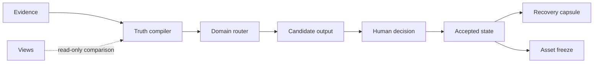

# Personal AI OS Core

An authority-aware control plane for long-running personal AI agents.

This repository contains a small, runnable core. It resolves facts from evidence, limits each task to an explicit domain scope, keeps candidates separate from accepted state, builds compact recovery capsules, and detects asset drift.

[中文说明](README.zh-CN.md)

## Run it

Python 3.10 or newer is enough. The core has no runtime dependencies.

```bash
make demo
make test
```

The demo uses synthetic data and returns a machine-readable result:

```json
{"checks":["asset_freeze","candidate_promotion","domain_route","truth_compile"],"data_source":"synthetic","status":"SAFE"}
```

Install the command when you want to call it outside the repository:

```bash
python3 -m pip install --no-deps -e .
personal-ai-os demo
```

## Core contracts

| Module | Contract |
|---|---|
| Truth compiler | Accepted evidence can set current truth. Dashboards and snapshots remain views. Equal-authority conflicts return `UNKNOWN`. |
| Domain router | Every route declares its domain, executor, allowed inputs, and allowed outputs. Missing or out-of-scope routes stop. |
| Candidate promotion | A candidate needs evidence and a matching human final decision before it becomes accepted. |
| Continuity capsule | Recovery state contains only authority, current state, and the next action, with a deterministic digest. |
| Asset freeze | A manifest records exact file digests. Missing or changed files block verification. |



## Data boundary

The repository contains synthetic examples only. It excludes credentials, personal paths, private memory, business records, research results, run logs, and historical receipts. Integrations with model providers, browsers, cloud storage, and messaging systems stay outside this core.

## Status and license

Version `0.1.0` is a preview. The owner has not selected an open-source license, so no permission is granted to copy, modify, or redistribute the code beyond rights provided by law. Choose a license before making the repository public.
