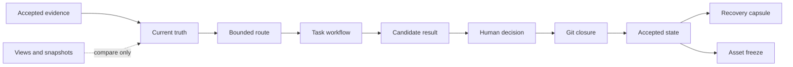

# Personal AI OS Core

**A recoverable control-plane kernel for persistent AI agents.**

Most agent frameworks focus on completing the next tool call. Persistent agents have a different problem: they must preserve authority, scope, review state, and recovery context across sessions, machines, models, and human handoffs.

Personal AI OS Core turns those concerns into small, deterministic Python contracts. Ambiguous facts resolve to `UNKNOWN`; out-of-scope work and results without evidence resolve to `BLOCKED`.

[中文说明](README.zh-CN.md)

## The problem it solves

A long-running agent needs reliable answers to questions that a chat transcript cannot settle:

- Which evidence defines the current state, and which files are only views?
- What context may this task read, and what outputs may it create?
- Is an output still a candidate, or has a human accepted it?
- Is the task result committed, reviewable, and reversible?
- What is the smallest state package needed to resume work safely?
- Have frozen assets changed since they were accepted?

This repository provides the control-plane rules for those decisions. It is designed for agent infrastructure, local-first AI workspaces, multi-agent operations, and reliability tooling.

It is not a model orchestration framework, hosted assistant, vector database, or dump of a private workspace.

## Control loop



## Run it

Python 3.10 or newer is enough. The core has no runtime dependencies.

```bash
make demo
make test
```

The demo uses synthetic data and returns a machine-readable result:

```json
{"checks":["asset_freeze","candidate_promotion","domain_route","git_closure","truth_compile","workflow_transition"],"data_source":"synthetic","status":"SAFE"}
```

Install the command when you want to call it outside the repository:

```bash
python3 -m pip install --no-deps -e .
personal-ai-os demo
```

## Core contracts

| Module | Contract |
|---|---|
| Current truth compiler | Accepted evidence can set current truth. Dashboards and snapshots remain views. Missing evidence and equal-authority conflicts return `UNKNOWN`. |
| Domain router | Every route declares its domain, executor, allowed inputs, and allowed outputs. Missing or out-of-scope routes stop. |
| Workflow state | Task transitions are explicit, return appendable events, and do not mutate the source card. Review, completion, and archive transitions require Git closure. |
| Candidate promotion | A candidate needs evidence and a matching human final decision before it becomes accepted. |
| Git closure | A result needs a commit, an attested no-change outcome, or an external artifact reference. Uncommitted task changes block review; independent candidates need explicit acceptance before completion. |
| Continuity capsule | Recovery state contains only authority, current state, and the next action, with a deterministic digest. |
| Asset freeze | A manifest records exact file digests. Missing or changed files block verification. |

All contracts are pure or local-first. They return structured data and leave persistence, UI, and provider integrations to adapters outside the kernel.

## Example

```python
from personal_ai_os import evaluate_git_closure, transition_task

closure = evaluate_git_closure({
    "result_kind": "result_commit",
    "result_commit": "a1b2c3d4",
    "integration_status": "mainline",
    "dirty_paths": [],
})

result = transition_task(
    {"task_id": "demo", "status": "IN_PROGRESS", "git_closure": closure},
    "REVIEW",
    by="agent:demo",
)

assert result["ok"]
```

## Repository map

```text
src/personal_ai_os/   control-plane contracts and CLI
tests/                executable behavior specifications
examples/             synthetic manifests and task records
.github/workflows/    clean-install test matrix for Python 3.10–3.12
```

## Data boundary

The repository contains synthetic examples only. It excludes credentials, personal paths, private memory, business records, research results, run logs, and historical receipts. Model providers, browsers, cloud storage, messaging systems, live task boards, and private workspace adapters remain outside this core.

## Status and license

Version `0.1.0` is a private preview of the reusable kernel, not the full Personal AI OS runtime. The owner has not selected an open-source license, so no permission is granted to copy, modify, or redistribute the code beyond rights provided by law. Choose a license before making the repository public.
