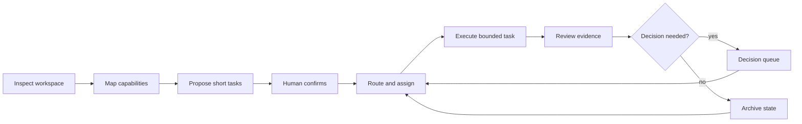

# Personal AI OS

Personal AI OS is a local-first operating layer for long-running AI work. It turns a long goal into short, assignable tasks, preserves the working context between runs, and returns consequential decisions to a person.

AI conversations are effective when one conversation owns one bounded task. Long work needs a separate control layer: tasks must be sequenced, branched, resumed, routed to different executors, and accepted against evidence. Personal AI OS provides that layer without replacing the models, tools, or workspaces that perform the work.

[中文说明](README.zh-CN.md) · [版本记录](CHANGELOG.md) · [产品边界](PRODUCT.md)

## Product model

The system has two cooperating surfaces:

- **Brain** — domain-aware context, approved working practices, task history, and evidence-backed continuity.
- **Hand** — task cards, dependency scheduling, model and tool adapters, run receipts, human gates, and bounded continuation.

The browser is a replaceable projection. SQLite and the runtime contracts remain the source of truth for task state, runs, events, artifacts, and decisions.

## Operating loop



Inspection and planning are read-only. Execution begins only after a task is accepted, its prerequisites are satisfied, and the runtime has acquired the task claim for an available adapter. Successful model output stops at review; the system does not approve its own work.

## Workbench

The public Workbench uses synthetic, anonymous data and keeps the product surface focused on three stable entrances:

| Entrance | Purpose |
|---|---|
| Module Map | Read the operating architecture, installed capability dependencies, inputs, outputs, feedback paths, and recursive module details. |
| Work Progress | Follow domains, worklines, task allocation, branches, loops, attempts, and the selected task's execution trace. |
| Decisions | Review plan approvals, blocked work, Human Gates, and the next action that requires a person. |

Task detail is an acceptance surface. It can show prerequisites, the latest registered result, production time, and the downstream consequence of a decision. Public-safe projection keeps task copy and private artifacts out of the browser.

```bash
make workbench
```

Open [http://127.0.0.1:8787](http://127.0.0.1:8787). The static demo stays in browser memory and does not read a local workspace.

## Local runtime

The optional local runtime uses Python and SQLite. It serves the same Workbench through a finite JSON API and persists workflows, tasks, runs, events, artifacts, decisions, and durable goals.

```bash
python3 -m pip install --no-deps -e .
personal-ai-os runtime init \
  --store .personal-ai-os/runtime.db \
  --preset science

personal-ai-os runtime serve \
  --store .personal-ai-os/runtime.db \
  --routes examples/runtime-routes.json \
  --projection-mode private-local
```

The API key stays in the server process environment. Runtime context, local paths, Git closure, credentials, and private task bodies do not enter public Git or public-safe browser projections. Keep actual plans and route credentials under the ignored `.personal-ai-os/` directory.

The runtime supports bounded continuation, per-task route selection, Human Gates, recovery stops, evidence review, and optional model-specific work pets. Streaming, cancellation, remote-machine adapters, automatic memory approval, and unattended daemon scheduling remain explicit extension points.

## Plug-in contract

Modules connect through named capabilities instead of importing one another. A module declares a versioned manifest:

```json
{
  "contract_version": "personal-ai-os.module/v1",
  "module_id": "local-exporter",
  "name": "Local Exporter",
  "layer": "output",
  "summary": "Exports an artifact reference.",
  "provides": ["artifact.export"],
  "requires": ["execution.result"],
  "availability": "READY",
  "optional": true,
  "entrypoint": "local_exporter:activate"
}
```

The module graph resolves capability providers, reports missing or duplicate interfaces, and supports recursive inspection. Adding or removing a valid manifest does not require a layout change in the Workbench.

```bash
personal-ai-os modules --directory examples/modules
```

## Local CLI

```bash
personal-ai-os inspect ./workspace
personal-ai-os modules
personal-ai-os plan ./workspace
personal-ai-os spec
```

These commands emit machine-readable JSON. `inspect` and `plan` remain read-only; a dirty Git workspace is surfaced as a human boundary instead of being silently absorbed.

## Repository map

```text
src/personal_ai_os/   planning, routing, runtime, adapter, secretary, module, state, and recovery contracts
workbench/            interactive runtime client with an anonymous static fallback
tests/                Python and Workbench behavior tests
examples/             synthetic state records and example module manifests
docs/                 versioned taskbooks, acceptance records, research, and license notes
```

Version-specific changes live in [CHANGELOG.md](CHANGELOG.md) and the corresponding documents under [`docs/`](docs/), not in this README.

## Public boundary and license

This repository contains a reusable product skeleton and synthetic demonstrations. Private memory, source material, personal paths, run receipts, model accounts, credentials, and local adapters stay outside the repository.

The code is available under the [PolyForm Noncommercial License 1.0.0](LICENSE). Personal and noncommercial use within that license is permitted with the required copyright notice. Commercial use requires a separate paid written license from Dengk3Li and attribution. No public commercial contact channel is provided at this time, so commercial rights are not granted unless a separate license has been executed. See [Commercial use](COMMERCIAL_USE.md).
