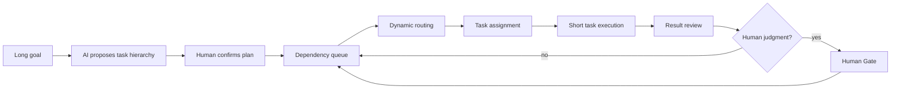

# Personal AI OS

Turn long goals into executable short tasks, keep progress visible, and let people intervene where judgment matters.

AI conversations handle local tasks well. Long work crosses many conversations, so each new conversation has to reconstruct and verify earlier context. Plan Mode can propose a plan, but the plan still needs an operating surface that schedules tasks, assigns execution, collects decisions, and advances the next step.

Personal AI OS adds that human-interactive operating layer. The system proposes a task hierarchy and a person confirms it. Satisfied dependencies release tasks into dynamic routing and assignment. Human Gates hold decisions that need judgment. Once a person records the decision, execution continues from the current state.

[中文说明](README.zh-CN.md)


## Operating loop



The loop provides four product behaviors:

- Decompose long-form writing, research, and other sustained work into short tasks with dependencies and acceptance conditions.
- Show hierarchy and progress without reconstructing project state from chat transcripts.
- Select an execution route and executor from task complexity, capabilities, and context budget.
- Keep plan approval, consequential decisions, and result acceptance under human control.

## Three-board workspace

The repository includes an interactive demo backed by synthetic research tasks:

```bash
make workbench
```

Open [http://127.0.0.1:8787](http://127.0.0.1:8787).

All three boards read the same long-task state:

| Board | Responsibility |
|---|---|
| System map | Read-only view of the path from long goal through decomposition, human decisions, routing, assignment, review, and cross-conversation continuation. |
| Work progress | Shows hierarchy, dependencies, executor, route, context estimate, and acceptance state. Completing prerequisites releases the next task. |
| Decisions | Holds plan approval and Human Gates. Approval releases work; rejection keeps the task blocked. |

Research, long-form writing, and other domains enter the work board as task content instead of adding more primary boards. The interface shares Cognitive Intake's paper surface, ink green, signal lime, serif headings, and split-card structure.

Demo state stays in the current browser page and does not read a private workspace.

## Current capabilities

| Capability | Current behavior |
|---|---|
| Long-task planning | Validates task IDs, hierarchy, dependencies, and acceptance conditions. Missing dependencies and cycles block the plan. |
| Human plan approval | AI-generated plans remain candidates until a person accepts them. |
| Dependency scheduling | Releases only tasks whose prerequisites and Human Gates are satisfied. |
| Dynamic routing | Selects the smallest execution tier that meets complexity, capability, and context requirements. |
| Task assignment | Chooses an executor with compatible capabilities, route support, and free capacity. |
| Three-board projection | Derives the read-only system map, work progress, and decision queue from one task state. |
| Human judgment | Pauses at plan approval, consequential tasks, and result acceptance. |
| Long-run reliability | Current truth, continuity capsules, Git closure, and asset freeze support recovery and verification. |

## Initial use cases

The first use cases come from active work:

- long-form writing, including research reviews, industry reports, investment material, and multi-section documents;
- research workflows spanning question definition, literature work, experiments, evidence synthesis, and result review;
- projects that require many model calls, multiple executors, and stage-level acceptance across conversations.

Each short task can use a different model or executor. People follow the plan and decisions instead of supervising every model call.

## Dynamic routing and Token Manager

Dynamic routing is part of the current kernel. A task declares complexity, required capabilities, and estimated context. The router selects an execution tier that satisfies those requirements. Manual overrides pass through the same checks.

Token Manager is the next extension. Task records and the workbench already carry `estimated_context_tokens` and route windows. The planned scope includes:

- per-task Token forecasts and usage records;
- checkpoints and context compaction at thresholds;
- budget reallocation while a long task is running;
- cost, context capacity, and execution-quality comparisons across models.

The repository does not claim an implementation that has not been merged from the separate Token Manager discussion.

## Run the kernel

The Python kernel requires Python 3.10 or newer. Workbench behavior tests use Node.js.

```bash
make demo
make test
```

Machine-readable demo output:

```json
{"checks":["asset_freeze","candidate_promotion","domain_route","dynamic_route","git_closure","long_task_plan","task_assignment","truth_compile","workbench_projection","workflow_transition"],"data_source":"synthetic","status":"SAFE"}
```

Install the Python API:

```bash
python3 -m pip install --no-deps -e .
personal-ai-os demo
```

## Repository map

```text
src/personal_ai_os/   planning, routing, assignment, state, and recovery contracts
workbench/            interactive synthetic long-task workbench
tests/                Python and workbench behavior tests
examples/             synthetic truth and task records
.github/workflows/    install and test matrix for Python 3.10–3.12
```

## Publication boundary

This repository contains the reusable product skeleton and synthetic demonstrations. Private memory, business material, research results, personal paths, run receipts, model accounts, and local adapters stay outside the repository.

Version `0.3.0` is a private preview. A license must be selected before publication; the repository currently grants no permission to copy, modify, or redistribute the code beyond rights provided by law.
