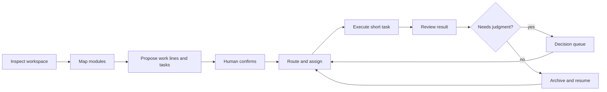

# Personal AI OS

An operating layer for long-running AI work: compose capabilities, turn messy workspaces into parallel work lines, and keep people in control of consequential decisions.

Most AI conversations are good at finishing one bounded task. Long work breaks that model. A new conversation must reconstruct and verify earlier context, plans do not advance themselves, and progress becomes scattered across chats. Personal AI OS turns a long goal into short executable tasks, preserves their shared state, and gives people a clear place to inspect progress and intervene.

[中文说明](README.zh-CN.md)

[v0.6 development taskbook (Chinese)](docs/DEVELOPMENT_TASKBOOK_V0.6.md)


## What is different

Personal AI OS is not another project-management dashboard. It defines a small operating system for AI work:

- a **Module Map** shows reusable capabilities and their dependencies as composable building blocks;
- **Work Progress** holds the overall plan and parallel research, product, writing, or custom work lines;
- **Decisions** collects plan confirmation, blocked work, and Human Gates in one place;
- a shared operation contract tells the next AI how to inspect, map, plan, route, execute, review, and archive work;
- a local CLI exposes the same contract for scripts and advanced users.

Research is a work line inside Work Progress, not a second source of task truth. Its future research-trace model is deliberately left open until the product requirements are decided.

## The operating loop



The invariant is simple: inspection and planning are read-only candidates. Workspace changes begin only after confirmation and stay inside the accepted task boundary.

## Three-entry workspace

Run the synthetic interactive demo:

```bash
make workbench
```

Open [http://127.0.0.1:8787](http://127.0.0.1:8787).

| Entrance | Responsibility |
|---|---|
| Module Map | Shows modules, layers, provided capabilities, required capabilities, composition templates, and honest availability. Token Manager is marked as planned. |
| Work Progress | Shows overall phase and progress, parallel business lines, line-specific layouts, universal task states, routing, assignment, and acceptance actions. |
| Decisions | Centralizes plan approval, blocked work, and Human Gates so judgment does not disappear inside old conversations. |

The demo uses synthetic data and does not read a private workspace.

## First-run workspace intake

The local intake is designed for a new or messy repository. It performs a bounded read-only scan, detects project and Git signals, suggests modules and work lines, and returns a candidate plan for human confirmation. A dirty repository gets an explicit preflight Human Gate for preserving and assigning existing changes.

```bash
personal-ai-os inspect ./workspace
personal-ai-os modules
personal-ai-os plan ./workspace
personal-ai-os spec
```

All commands emit machine-readable JSON. For example, `plan` returns candidate business lines, initial tasks, the resolved module graph, and the complete operation chain. It does not write into the inspected workspace.

## Composable modules

Every module declares a small manifest:

```json
{
  "module_id": "dynamic-router",
  "layer": "orchestration",
  "provides": ["execution.route"],
  "requires": ["work.task"],
  "availability": "READY"
}
```

The graph resolver connects requirements to providers and blocks a composition with unresolved or duplicate capabilities. The built-in catalog currently includes:

- local workspace intake;
- Cognitive Intake;
- long-work workflow core;
- dynamic routing;
- execution adapter;
- continuity and cross-conversation resume;
- Token Manager as a planned extension.

## Parallel work lines and task creation

The same task state can be projected differently for different work:

- research can use a left-to-right stage line and an unassigned task table;
- product work can use milestones;
- writing can use a material-to-draft pipeline.

The workbench also accepts a plain-language request such as “organize industry material and draft a long report.” It proposes a task, business line, execution tier, and model route before adding the task to the unassigned queue. Manual creation and future dynamic dispatch use the same task contract.

Universal user-facing states are: unassigned, in progress, review, blocked, closed, archived, and completed. The existing kernel keeps its validated execution-state compatibility while the operation spec exposes these product-level meanings.

## Current kernel

| Capability | Current behavior |
|---|---|
| Long-task planning | Validates hierarchy, dependencies, acceptance conditions, missing references, and cycles. |
| Human plan approval | AI plans remain candidates until a person accepts them. |
| Dependency scheduling | Releases only tasks whose prerequisites and Human Gates are satisfied. |
| Dynamic routing | Selects the smallest available tier that meets complexity, capability, and context requirements. |
| Task assignment | Chooses a compatible executor with capacity. |
| Operation protocol | Defines inspect → map → plan → confirm → route → execute → review → archive. |
| Module composition | Resolves provided and required capabilities and fails closed on broken graphs. |
| Read-only intake | Scans local structure and proposes a work map without writing to the target. |
| Long-run continuity | Truth compilation, continuity capsules, Git closure, and asset freeze support recovery and verification. |

## Run and test

Python 3.10 or newer is required. Workbench behavior tests use Node.js.

```bash
make demo
make test
```

Install the CLI and Python API:

```bash
python3 -m pip install --no-deps -e .
personal-ai-os spec
```

## Repository map

```text
src/personal_ai_os/   planning, routing, module, intake, operation, state, and recovery contracts
workbench/            interactive synthetic Long Work workspace
tests/                Python and browser-workbench behavior tests
examples/             synthetic truth and task records
.github/workflows/    Python 3.10–3.12 install and test matrix
PRODUCT.md            durable product boundaries and open decisions
docs/DEVELOPMENT_TASKBOOK_V0.6.md  real-runtime, nonlinear-workflow, pet, and adapter plan
```

## Publication boundary

This repository contains the reusable product skeleton and synthetic demonstrations. Private memory, business material, research results, personal paths, run receipts, model accounts, and local adapters stay outside the repository.

Version `0.5.0` is a public source preview. The next implementation scope is tracked in the [v0.6 development taskbook](docs/DEVELOPMENT_TASKBOOK_V0.6.md). No open-source license has been selected, so the repository does not grant permission to copy, modify, or redistribute the code beyond rights provided by law.
