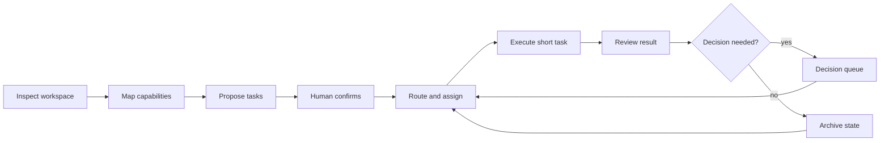

# Personal AI OS

Personal AI OS is a local-first operating layer for long-running AI work. It breaks a long goal into independently assignable short tasks, preserves shared state, and brings consequential decisions back to a person.

AI chat works well when one conversation owns one bounded task. Longer work is different: every new conversation must reconstruct earlier context, a generated plan does not know how to keep moving, and parallel attempts quickly become hard to verify. Personal AI OS adds the missing control layer between a long goal and individual AI runs.

[中文说明](README.zh-CN.md) · [v0.9 taskbook](docs/DEVELOPMENT_TASKBOOK_V0.9.md)

The project is intentionally narrower than a general-purpose agent platform. Existing tools already provide browsers, terminals, schedules, memory, subagents, and remote runtimes. Personal AI OS focuses on the layer above them: workspace structure, transferable task state, evidence-backed acceptance, decision packets, and continuity across executors.

## v0.6 workflow showcase

The public workbench uses an anonymous synthetic fixture. It keeps workflow structure, task counts, assignments, run attempts, and event traces while omitting task titles, acceptance copy, source material, and private paths.

The default fixture contains 18 tasks across three workflow shapes:

- a scientific workflow coordinated by Hypothesis, Protocol Design, Autonomous Experiment, Data Analysis, and Feedback Optimization agents, with parallel experiment paths;
- a meeting-notes workflow from recordings, decks, and project material through extraction, drafting, review, and delivery;
- a deep analytical-report workflow from source collection and an evidence pool through argument planning, chapter writing, layout, and illustration.

Eleven tasks are assigned, three are running, two await review, six are closed, and four repeated runs remain visible. Select any node to inspect its agent, model, execution adapter, attempt number, heartbeat, and artifact events. Running nodes can show a model-specific animal or the optional Blue Whale Maid animation; the user can disable pets without changing task state.

```bash
make workbench
```

Open [http://127.0.0.1:8787](http://127.0.0.1:8787). In static mode the demo stays in browser memory and does not read a local workspace.

## v0.7 self-hosting slice

The local runtime is built with Python and SQLite. It stores workflows, tasks, runs, events, artifacts, and decisions, and serves the same workbench through a finite local API. A versioned runtime plan can now register real local worklines idempotently: the plan creates missing workflows and tasks but never resets an existing task's state, context, run evidence, or result.

Keep actual plans under the ignored `.personal-ai-os/` directory. This lets Personal AI OS govern development of its own repository while keeping local paths, private project names, and current task bodies out of public Git.

Task `context` is server-side recovery metadata and is omitted from the browser projection. It is not sent wholesale to a model. A model request contains the task envelope, an explicit `context.model_context` object capped at 12,000 characters, and bounded accepted upstream artifacts. Local paths must stay out of those model-bound fields and artifacts.

```bash
python3 -m pip install --no-deps -e .
personal-ai-os runtime init \
  --store .personal-ai-os/runtime.db \
  --preset science

personal-ai-os runtime sync-plan \
  --store .personal-ai-os/runtime.db \
  --plan .personal-ai-os/self-hosting-plan.private.json

export PERSONAL_AI_OS_API_BASE="https://your-compatible-endpoint.example/v1"
export PERSONAL_AI_OS_API_KEY="your-local-secret"
personal-ai-os runtime serve \
  --store .personal-ai-os/runtime.db \
  --model "your-model-id"
```

Open [http://127.0.0.1:8787](http://127.0.0.1:8787). When the API is present, the page switches from the synthetic fixture to the local runtime. Creating a workline or task, starting a model run, accepting a result, and recording a decision now write to SQLite. The API key is read from the server process and is never written to the store.

Before the adapter request begins, the runtime atomically claims the task, creates a local run, and moves the task to `IN_PROGRESS`. The Workbench polls the persisted projection while the synchronous request is pending, so the working pet reflects a real model call rather than a synthetic heartbeat. A successful response adds the external run identity, artifact, and review transition. A failed request remains visible as a rejected run and blocked task. Separate runtime instances sharing one SQLite store race on the same state transition before either calls the model, so only the successful claimant executes it.

New tasks cannot claim completed evidence. Browser writes require JSON from the same loopback origin; a local non-browser client may call the finite JSON API without an `Origin` header. Streaming tokens, cancellation, a server-side pet registry, Codex/VS Code control, remote-machine adapters, and recursive whole-repository abstraction remain follow-up work.

## v0.8 bounded auto advance

The runtime can now process currently ready tasks through one bounded synchronous command or API request. Selection is deterministic: a task must be `QUEUED`, all dependencies must be `DONE` or `ARCHIVED`, and no pending decision may exist. Each selected task is atomically claimed before its Adapter is called.

Successful model output still stops at `REVIEW`. Human Gates create one persisted decision, blocked or paused work is not retried, and an interrupted `IN_PROGRESS` task is left for recovery instead of being dispatched again. A `max_steps` boundary prevents an invocation from becoming an unbounded daemon.

```bash
personal-ai-os runtime advance \
  --store .personal-ai-os/runtime.db \
  --workflow science \
  --adapter openai-compatible \
  --model "your-model-id" \
  --max-steps 25 \
  --failure-budget 1
```

The Work Progress page exposes the same action as **Advance current workflow** and keeps polling persisted state while model calls are active. The CLI can omit `--workflow` for an explicitly global run.

One v0.8 invocation uses the same configured model and Adapter for its selected tasks and processes them in stable order. Background unattended progression, streaming, cancellation, and interrupted external-run reconciliation remain follow-up work.

The second v0.8 slice is a references-only Domain Context compiler. It selects exactly one domain profile, orders its approved context layers, and rejects ambiguous domains or unrecognized layers. It does not load memory bodies.

```bash
personal-ai-os domain-context \
  --registry examples/domain-profiles.json \
  --domain software
```

## v0.9 per-task execution routes

Auto advance can now choose a route for each task from a versioned server-side catalog. Selection uses the task tier, required capabilities, estimated context size, route availability, and an optional explicit route. The smallest compatible route wins; an explicit route cannot lower task requirements.

Route catalogs contain model and Adapter identifiers, never API keys or endpoint credentials. Secrets remain in the server process environment.

```bash
personal-ai-os runtime advance \
  --store .personal-ai-os/runtime.db \
  --workflow science \
  --routes examples/runtime-routes.json \
  --max-steps 25

personal-ai-os runtime serve \
  --store .personal-ai-os/runtime.db \
  --routes examples/runtime-routes.json
```

Human Gates are evaluated before route availability. The chosen route is recorded only by the process that atomically claims the task, and is tied to that run ID. Competing processes cannot leave conflicting route evidence. Each Adapter is probed once per dispatch even when several routes use it.

## Operating model



Inspection and planning produce read-only candidates. Workspace changes begin after confirmation and remain inside the accepted task boundary. A task is running only after the runtime has persisted a run and atomically claimed the task for an available adapter; changing a label in the interface is not enough.

## Three stable entrances

| Entrance | Responsibility |
|---|---|
| Module Map | Shows layers, real dependencies, upstream and downstream relationships, availability, and replaceable slots in a draggable, zoomable topology. A module annotation becomes a bounded task in the active workflow. |
| Work Progress | Shows allocation totals, loops, parallel branches, repeated attempts, and the selected node's run trace. |
| Decisions | Collects plan approval, blocked work, and Human Gates in one place. |

This is an operating interface, not a management dashboard. The product proves execution through state transitions, run events, artifacts, and human acceptance. Feature count and presentation do not substitute for a working loop.

## Plug-in module contract

Modules connect through named capabilities instead of importing one another. A module declares a versioned manifest:

```json
{
  "contract_version": "personal-ai-os.module/v1",
  "module_id": "local-exporter",
  "name": "Local Exporter",
  "layer": "output",
  "summary": "Exports an artifact reference.",
  "provides": ["artifact.export"],
  "requires": ["execution.result"],
  "availability": "READY",
  "optional": true,
  "entrypoint": "local_exporter:activate"
}
```

`discover_module_manifests()` reads direct-child `module.json` files without importing plug-in code. `build_module_graph()` resolves capability providers, reports missing or duplicate interfaces, and rejects direct module references. Adding or removing a valid manifest does not require a layout change in the workbench.

```bash
personal-ai-os modules --directory examples/modules
```

Built-in modules cover bounded workspace intake, Cognitive Intake, workflow state, dynamic routing, execution adaptation, continuity, and a planned Token Manager slot.

## Local CLI

```bash
personal-ai-os inspect ./workspace
personal-ai-os modules
personal-ai-os plan ./workspace
personal-ai-os spec
```

The commands emit machine-readable JSON. `inspect` and `plan` remain read-only; a dirty Git workspace becomes an explicit human boundary instead of being silently absorbed.

## Kernel capabilities

| Capability | Behavior |
|---|---|
| Long-task planning | Validates hierarchy, dependencies, acceptance conditions, missing references, and cycles. |
| Human confirmation | Keeps generated plans as candidates until a person accepts them. |
| Dependency scheduling | Releases only tasks whose prerequisites and Human Gates are satisfied. |
| Bounded auto advance | Dispatches every currently ready task once, records selection and outcome events, and stops at review, decisions, blocked work, recovery, or the step limit. |
| Per-task execution routing | Auto advance chooses the smallest available route that satisfies capability, tier, and context requirements, then atomically binds it to the claimed run. |
| Domain context compiler | Loads one domain through a fixed references-only allowlist and fails closed on ambiguity or unknown layers. |
| Task assignment | Selects a compatible executor with capacity. |
| Module composition | Resolves versioned capability manifests and fails closed on broken graphs. |
| Module issue handoff | Turns a selected module annotation into a persistent, assignable task without creating a second task system. |
| Read-only intake | Inspects local structure and proposes a work map without modifying the target. |
| Continuity | Preserves enough state to resume and verify a later run. |
| Persistent runtime | Stores task, run, event, artifact, and decision records in SQLite and replays them after restart. |
| Runtime plan sync | Imports a versioned local work plan idempotently without overwriting live runtime truth. |
| Secretary brief | Projects active work, pending review, blockers, and next actions without copying private memory bodies. |
| Compatible model adapter | Executes one bounded task through a configured Chat Completions-compatible endpoint. |
| Selectable working pet | Renders an optional lazy-loaded Blue Whale Maid GIF or a model animal only while a persisted task is running. |

## Install and test

Python 3.10 or newer is required. Workbench behavior tests use Node.js.

```bash
python3 -m pip install --no-deps -e .
make demo
make test
```

## Repository map

```text
src/personal_ai_os/   planning, routing, runtime, adapter, secretary, module, state, and recovery contracts
workbench/            interactive runtime client with an anonymous static fallback
tests/                Python and workbench behavior tests
examples/             synthetic state records and an example module manifest
.github/workflows/    Python 3.10-3.12 install and test matrix
PRODUCT.md            durable product boundaries
docs/DEVELOPMENT_TASKBOOK_V0.9.md  per-task routing and runtime-evidence acceptance plan
docs/REPOSITORY_ACCEPTANCE_V0.6.zh-CN.md  v0.6 package acceptance boundary
```

## Public boundary and license

This repository contains a reusable product skeleton and synthetic demonstrations. Private memory, source material, personal paths, run receipts, model accounts, credentials, and local adapters stay outside the repository.

The code is available under the [PolyForm Noncommercial License 1.0.0](LICENSE). Personal and noncommercial use within that license is permitted with the required copyright notice. Commercial use requires a separate paid written license from Dengk3Li and attribution. No public commercial contact channel is provided at this time, so commercial rights are not granted unless a separate license has been executed. See [Commercial use](COMMERCIAL_USE.md).
