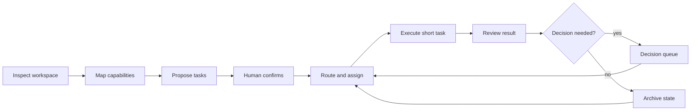

# Personal AI OS

Personal AI OS is a local-first operating layer for long-running AI work. It breaks a long goal into independently assignable short tasks, preserves shared state, and brings consequential decisions back to a person.

AI chat works well when one conversation owns one bounded task. Longer work is different: every new conversation must reconstruct earlier context, a generated plan does not know how to keep moving, and parallel attempts quickly become hard to verify. Personal AI OS adds the missing control layer between a long goal and individual AI runs.

[中文说明](README.zh-CN.md) · [v0.18 taskbook](docs/DEVELOPMENT_TASKBOOK_V0.18.md) · [v0.19 taskbook](docs/DEVELOPMENT_TASKBOOK_V0.19.md)

The project is intentionally narrower than a general-purpose agent platform. Existing tools already provide browsers, terminals, schedules, memory, subagents, and remote runtimes. Personal AI OS focuses on the layer above them: workspace structure, transferable task state, evidence-backed acceptance, decision packets, and continuity across executors.

## v0.6 workflow showcase

The public workbench uses an anonymous synthetic fixture. It keeps workflow structure, task counts, assignments, run attempts, and event traces while omitting task titles, acceptance copy, source material, and private paths.

The default fixture contains 18 tasks across three workflow shapes:

- a scientific workflow coordinated by Hypothesis, Protocol Design, Autonomous Experiment, Data Analysis, and Feedback Optimization agents, with parallel experiment paths;
- a meeting-notes workflow from recordings, decks, and project material through extraction, drafting, review, and delivery;
- a deep analytical-report workflow from source collection and an evidence pool through argument planning, chapter writing, layout, and illustration.

Eleven tasks are assigned, three are running, two await review, six are closed, and four repeated runs remain visible. Select any node to inspect its agent, model, execution adapter, attempt number, heartbeat, and artifact events. Running nodes can show a model-specific animal or the optional Blue Whale Maid animation; the user can disable pets without changing task state.

```bash
make workbench
```

Open [http://127.0.0.1:8787](http://127.0.0.1:8787). In static mode the demo stays in browser memory and does not read a local workspace.

## v0.7 self-hosting slice

The local runtime is built with Python and SQLite. It stores workflows, tasks, runs, events, artifacts, and decisions, and serves the same workbench through a finite local API. A versioned runtime plan can now register real local worklines idempotently: the plan creates missing workflows and tasks but never resets an existing task's state, context, run evidence, or result.

Keep actual plans under the ignored `.personal-ai-os/` directory. This lets Personal AI OS govern development of its own repository while keeping local paths, private project names, and current task bodies out of public Git.

Task `context` is server-side recovery metadata and is omitted from the browser projection. It is not sent wholesale to a model. A model request contains the task envelope, an explicit `context.model_context` object capped at 12,000 characters, and bounded accepted upstream artifacts. Local paths must stay out of those model-bound fields and artifacts.

```bash
python3 -m pip install --no-deps -e .
personal-ai-os runtime init \
  --store .personal-ai-os/runtime.db \
  --preset science

personal-ai-os runtime sync-plan \
  --store .personal-ai-os/runtime.db \
  --plan .personal-ai-os/self-hosting-plan.private.json

export PERSONAL_AI_OS_API_BASE="https://your-compatible-endpoint.example/v1"
export PERSONAL_AI_OS_API_KEY="your-local-secret"
personal-ai-os runtime serve \
  --store .personal-ai-os/runtime.db \
  --model "your-model-id"
```

Open [http://127.0.0.1:8787](http://127.0.0.1:8787). When the API is present, the page switches from the synthetic fixture to the local runtime. Creating a workline or task, starting a model run, accepting a result, and recording a decision now write to SQLite. The API key is read from the server process and is never written to the store.

Before the adapter request begins, the runtime atomically claims the task, creates a local run, and moves the task to `IN_PROGRESS`. The Workbench polls the persisted projection while the synchronous request is pending, so the working pet reflects a real model call rather than a synthetic heartbeat. A successful response adds the external run identity, artifact, and review transition. A failed request remains visible as a rejected run and blocked task. Separate runtime instances sharing one SQLite store race on the same state transition before either calls the model, so only the successful claimant executes it.

New tasks cannot claim completed evidence. Browser writes require JSON from the same loopback origin; a local non-browser client may call the finite JSON API without an `Origin` header. Streaming tokens, cancellation, a server-side pet registry, Codex/VS Code control, remote-machine adapters, and recursive whole-repository abstraction remain follow-up work.

## v0.8 bounded auto advance

The runtime can now process currently ready tasks through one bounded synchronous command or API request. Selection is deterministic: a task must be `QUEUED`, all dependencies must be `DONE` or `ARCHIVED`, and no pending decision may exist. Each selected task is atomically claimed before its Adapter is called.

Successful model output still stops at `REVIEW`. Human Gates create one persisted decision, blocked or paused work is not retried, and an interrupted `IN_PROGRESS` task is left for recovery instead of being dispatched again. A `max_steps` boundary prevents an invocation from becoming an unbounded daemon.

```bash
personal-ai-os runtime advance \
  --store .personal-ai-os/runtime.db \
  --workflow science \
  --adapter openai-compatible \
  --model "your-model-id" \
  --max-steps 25 \
  --failure-budget 1
```

The Work Progress page exposes the same action as **Advance current workflow** and keeps polling persisted state while model calls are active. The CLI can omit `--workflow` for an explicitly global run.

One v0.8 invocation uses the same configured model and Adapter for its selected tasks and processes them in stable order. Background unattended progression, streaming, cancellation, and interrupted external-run reconciliation remain follow-up work.

The second v0.8 slice is a references-only Domain Context compiler. It selects exactly one domain profile, orders its approved context layers, and rejects ambiguous domains or unrecognized layers. It does not load memory bodies.

```bash
personal-ai-os domain-context \
  --registry examples/domain-profiles.json \
  --domain software
```

## v0.9 per-task execution routes

Auto advance can now choose a route for each task from a versioned server-side catalog. Selection uses the task tier, required capabilities, estimated context size, route availability, and an optional explicit route. The smallest compatible route wins; an explicit route cannot lower task requirements.

Route catalogs contain model and Adapter identifiers, never API keys or endpoint credentials. Secrets remain in the server process environment.

```bash
personal-ai-os runtime advance \
  --store .personal-ai-os/runtime.db \
  --workflow science \
  --routes examples/runtime-routes.json \
  --max-steps 25

personal-ai-os runtime serve \
  --store .personal-ai-os/runtime.db \
  --routes examples/runtime-routes.json
```

Human Gates are evaluated before route availability. The chosen route is recorded only by the process that atomically claims the task, and is tied to that run ID. Competing processes cannot leave conflicting route evidence. Each Adapter is probed once per dispatch even when several routes use it.

## v0.10 recursive system map and workflow structure

The Module Map now opens with a recursive view of the whole Personal AI OS: secretary entry, task-scoped personal context, domain abstraction, long-task orchestration, domain work systems, model and tool execution, evidence-backed delivery, and the feedback path into the next round. Real edges remain visible on the draggable canvas. Double-clicking a composite module opens its internal graph; breadcrumbs return to the system view.

The public kernel also defines a versioned workflow structure with six node kinds: task, sequence, branch, join, condition, and bounded loop. Conditions reference registered server predicates instead of arbitrary code. An unknown condition waits for a human decision, and every loop requires a maximum iteration count. The structure compiler and evaluator are reusable today; binding their ready-node result directly to RuntimeStore and AutoAdvance is a follow-up boundary.

A local presentation pack can replace workflow and task display copy without modifying runtime truth. Its schema only accepts workflow names, captions, goals, bounded task labels, titles, acceptance copy, role names, and a presentation-only structure hint from `sequence / branch / join / condition / loop`. The hint changes the workflow reader, not scheduling or task state. Browser-visible workflow, task, domain, group, capability, run, artifact, event, and decision identifiers are replaced by stable ordinal aliases while the server resolves user actions back to runtime truth. Runtime context, paths, Git closure, credentials, and model payloads are rejected.

```bash
personal-ai-os runtime serve \
  --store .personal-ai-os/runtime.db \
  --model "your-model-id" \
  --presentation examples/presentation.zh-CN.json
```

## v0.11 focused worklines and explicit local projection

Work Progress now groups worklines under a primary domain tab and keeps only the selected workline in view. Domain and workline tabs use one runtime state source; switching either changes only the projection and does not transition a task. Unavailable execution settings leave workflow and task actions visibly disabled.

The Module Map inspector separates structural upstream and downstream dependencies from feedback relationships. A selected module explains its external inputs, internal process, main outputs, interface protocols, control boundary, and recursive child graph.

Runtime serving now has two explicit projection modes:

- `private-local` keeps real local task copy for a single user and can bind only to a loopback address;
- `public-safe` requires a validated presentation pack; workflow, task, model, Adapter, route, and assignment identifiers become stable public aliases, while Adapter protocol details and private copy stay outside the browser projection.

Both modes return a fixed Adapter catalog shape, the server's actual fixed/automatic routing readiness, and stable error reasons. `private-local` is a local trust boundary, not a publishing or network-sharing mode.

```bash
personal-ai-os runtime serve \
  --store .personal-ai-os/runtime.db \
  --model "your-model-id" \
  --projection-mode private-local
```

## v0.12 durable goals and bounded continuation

A durable goal now sits above individual worklines. It stores the objective, scoped workflow IDs, completion criteria, continuation limits, cumulative steps, observed model-token usage, and an append-only goal event trail in SQLite. A goal survives process restarts without being inferred again from chat.

Goal continuation reuses the existing dependency, Human Gate, routing, task-claim, review, and recovery boundaries. One continuation can advance several registered worklines, but it remains bounded by per-call and total budgets. Reaching a step or token limit sets `BUDGET_LIMITED`; closing every scoped task sets `AWAITING_ACCEPTANCE`. Neither state is success. Only an explicit owner action with completion evidence sets `COMPLETE`.

```bash
personal-ai-os runtime goal-create \
  --store .personal-ai-os/runtime.db \
  --goal examples/durable-goal.json

personal-ai-os runtime goal-continue \
  --store .personal-ai-os/runtime.db \
  --goal-id goal:science-release \
  --adapter openai-compatible \
  --model "your-model-id"
```

The private-local Workbench shows the current durable goal, persisted budget usage, and one continuation action above the Domain/workline tabs. A SQLite continuation claim prevents competing processes from advancing the same goal twice. An unfinished claim after a crash fails closed as `GOAL_RECOVERY_REQUIRED`; v0.12 does not pretend to reconcile an unknown external side effect.

This slice independently implements general control-plane mechanisms after reviewing Prime Agent, LangGraph, OpenHands, Letta Code, and LoopX. It does not copy their source code, product UI, trademarks, or brand assets. See [reference project license notes](docs/REFERENCE_PROJECT_LICENSES_V0.12.md).

## v0.19 bounded runtime continuity

The runtime acceptance projection now carries a references-only continuity capsule for each task. It keeps the task and dependency states, the latest run reference, the latest decision reference, bounded artifact references, and one short next action. Rich task text, model output, local paths, and credentials are filtered before the capsule is built. The capsule is pure and hashed, so it can be attached to the existing runtime and approved-memory projections without another database or daemon.

In `public-safe` mode, the same capsule is built after the existing identifier projection and therefore contains only stable public aliases. A capsule describes where a later executor should resume; it never resumes work, accepts a result, or promotes a memory candidate by itself. The design is informed by durable continuation, checkpoint/interrupt, event/execution separation, and persistent-context patterns documented in the v0.12 and v0.13 taskbooks.

## v0.13 cognitive practice and module-task links

The reusable “brain” layer now stores evidence-backed working-practice candidates for one person or team and one domain. A candidate starts as `PROPOSED`; only an explicit review with a recorded reviewer can make it `APPROVED`, and that decision is appended to the review event trail. Model context loads only approved practices whose subject and domain match the current task. Practice count, statement length, and the combined model-context payload are bounded. The public core does not infer personality from conversations or promote memory automatically.

The “hand” layer now carries versioned links between a task and the module it builds, changes, uses, validates, or is blocked by. Confirmed links appear in both Work Progress and the Module Map. Analyzed links remain proposals until confirmed, and tasks without a module link stay visible as unlinked work. A module annotation preserves the selected module identity when it becomes a task.

```bash
personal-ai-os runtime memory-propose \
  --store .personal-ai-os/runtime.db \
  --candidate ./memory-candidate.private.json

personal-ai-os runtime memory-review \
  --store .personal-ai-os/runtime.db \
  --candidate-id candidate:writing:001 \
  --decision APPROVED \
  --by owner
```

Private legacy-card ingestion is implemented outside this public repository as a read-only adapter. It projects existing task truth into the generic envelope, reports reconciliation issues, and performs no import or state transition during preview. Automatic dialogue mining, automatic memory approval, capability self-installation, and recursive repository understanding remain unimplemented boundaries. Design references and license conditions are recorded in [v0.13 reference project notes](docs/REFERENCE_PROJECT_LICENSES_V0.13.md).

## v0.14 work protocols, backstage settings, and map boundaries

Workflows can now require a versioned `personal-ai-os.work-protocols/v1` contract. The broker resolves that protocol before it claims a run or calls an Adapter. A missing required protocol returns `WORK_PROTOCOL_REQUIRED`; the task remains `QUEUED` with no run or model call. Protocols carry bounded instruction references, template references, execution rules, a person-or-team memory subject, and a learning-review policy.

The built-in meeting workflow uses a source-first full-record protocol. It requires the raw transcript as the factual source, preserves the natural discussion order and complete information units, retains exact numbers and attribution, and never silently falls back to a concise summary. The protocol automatically loads approved working practices for its scoped team and domain. A successful run records a memory-review request; it does not approve or promote a habit. Evidence-backed candidates still require explicit review before they can enter a later model context.

```bash
personal-ai-os runtime serve \
  --store .personal-ai-os/runtime.db \
  --routes examples/runtime-routes.json \
  --protocols .personal-ai-os/work-protocols.private.json
```

Model, route, Adapter, and API configuration now lives in a backstage **Settings** panel. Work Progress only exposes start, continue, review, and decision actions. Fixed mode uses one server-side default Adapter, while automatic mode selects from the route catalog; browser ordering cannot override that choice. A route-only server can dispatch a selected task through its saved automatic route without asking the user to choose a model on the task card.

The Module Map now distinguishes **System Overview** from **Component Dependencies**. System Overview describes the operating architecture and recursive internal graphs. Component Dependencies describes installed manifests and capability supply/requirement edges. Every drilled graph retains its parent module and its external input, output, and feedback handoffs, so an internal module never appears as an isolated island.

## v0.15 browser execution bindings and Codex auto-configuration

A private-local runtime can now bind its execution layer from the top-right **Settings** panel. The browser can auto-detect the locally installed Codex CLI and its configured default model, or bind an OpenAI-compatible endpoint for the current local service session. API keys are accepted only by the loopback JSON endpoint, kept in the running process, and never returned by `/api/runtime`, written to SQLite, or copied into task events.

Task routes are edited in the same panel. The server validates the complete versioned route catalog before replacing the active binding; an invalid route leaves the previous settings unchanged. Codex execution follows the supported app-server sequence `initialize → initialized → thread/start → turn/start`, rejects interactive approval requests, and records a result only after `turn/completed`. See the official [Codex app-server protocol](https://developers.openai.com/codex/app-server) and [Codex configuration reference](https://developers.openai.com/codex/config-reference).

This browser binding is intentionally local and process-scoped. Codex reuses the machine's existing login without copying its credentials. OpenAI-compatible secrets must be entered again after the local runtime restarts. A live Broker run is shown as active work; a persisted `RUNNING` task seen by a different or restarted process remains behind the recovery gate.

### Project-native Codex tasks (unreleased)

The private Settings panel can bind each workline to a saved Codex project path. Starting a task writes one durable project-dispatch request instead of calling `thread/start` with only a working directory. A Codex desktop manager resolves that path to the app's real `projectId`, creates the task inside that project, records the returned thread and host IDs, and sends the final result back to the LongTask run. The task then moves to `REVIEW` through the normal Broker boundary.

The project worker passes an explicit `project_id`, `project_path`, `environment`, `model`, and `prompt` to the desktop bridge, with the title `LongTask · <task_id> · <dispatch_id后8位>`. A missing project ID, invalid path/environment, or unverified thread-to-project assignment stops the dispatch before it is bound; a filesystem path alone never substitutes for project ownership. The worker accepts a result only when a verified terminal receipt contains nonempty final output and confirms that no user input or Human Gate is waiting. `REVIEW` remains a human acceptance boundary: the worker does not auto-accept results, resolve gates, merge branches, or update `main`.

App-server `cwd` selects a filesystem location but does not assign a Codex desktop project. Project-native dispatch therefore fails closed behind a local queue when no desktop manager is available. Claims have a bounded lease, completion has one owner, and public-safe projections never expose project paths or dispatch payloads.

## v0.18 required memory read and review-only learning

A task may declare `context.memory_policy: "require_read"` when its execution must use approved working practices. The task must provide explicit `memory_refs`, a `memory_subject`, and a `memory_domain_id` matching the task domain. Missing, unapproved, source-unbound, oversized, or mismatched memory scope stops the Broker before it claims a run, leaving the task `QUEUED`.

Before claim, the Broker applies the source-agnostic `read_memory_context` contract to an explicitly supplied `registered_memory_refs` index (or the local candidate table through the same bounded projection). The model-bound context carries only selected, bounded references and their facts/decisions summaries. A successful run records a `CANDIDATE` `MEMORY_REVIEW_REQUESTED` event with the applied scope and approved references; it never writes, approves, or promotes a memory candidate automatically. Tasks without this policy retain the existing compatibility path.

The public `personal-ai-os.practice-candidate/v1` contract is a separate, reference-only boundary for adapter previews. It carries only a candidate reference, bounded source references, anonymous subject/domain scope references, and human review state. It has no practice statement, body, local path, business label, or credential. `PROPOSED` is unreviewed; `APPROVED` and `REJECTED` require a reviewer reference. The pure validator does not write long-term memory or approve a candidate, and it remains subject to the repository's [PolyForm Noncommercial license](LICENSE).

A minimal, synthetic reference-only payload is available at [`examples/practice_candidate.synthetic.json`](examples/practice_candidate.synthetic.json). Validate it without persistence with:

```bash
PYTHONPATH=src python3 - <<'PY'
import json
from pathlib import Path
from personal_ai_os import validate_practice_candidate

payload = json.loads(Path("examples/practice_candidate.synthetic.json").read_text())
print(validate_practice_candidate(payload))
PY
```

The current public suite covers this boundary with 299 Python tests and 89 Workbench tests (`make test`).

Task routing is a replaceable contract at the execution boundary. A task
declares only its tier (`complexity`), required capabilities, and an optional
`context.routing.estimated_context_tokens` budget. `task_route_requirements()`
normalizes that declaration and rejects runtime binding fields such as a model,
Adapter, or route. The server-owned, versioned catalog remains the only source
of those bindings. Invalid requirements and unavailable routes stop before the
runtime claims a run; they do not create a partial execution record.

## Operating model



Inspection and planning produce read-only candidates. Workspace changes begin after confirmation and remain inside the accepted task boundary. A task is running only after the runtime has persisted a run and atomically claimed the task for an available adapter; changing a label in the interface is not enough.

## Three stable entrances

| Entrance | Responsibility |
|---|---|
| Module Map | Shows the whole operating loop and its internal module graphs, together with real dependencies, inputs, outputs, feedback edges, availability, and replaceable slots. A module annotation becomes a bounded task in the active workflow. |
| Work Progress | Shows allocation totals, loops, parallel branches, repeated attempts, and the selected node's run trace. Task detail also explains prerequisites, the latest registered result, and downstream work using real event timestamps. |
| Decisions | Collects plan approval, blocked work, and Human Gates in one place. |

Task detail is an acceptance surface, not only a status card: a completed run exposes its registered artifact summary and production time, while a private-local projection may include a bounded preview. The causal sidebar follows the persisted dependency graph (前因 → 本轮结果 → 后果与下一步); public-safe projections keep the result generic and omit private artifact content.

The server also exposes a read-only `personal-ai-os.acceptance/v1` snapshot on each projected task. It joins the task card, latest execution, correlated event timeline, stage-artifact references, causality, and review boundary in one bounded contract. A terminal run can become `READY_FOR_REVIEW`, but only the persisted task decision can become `ACCEPTED`; public-safe mode aliases execution identifiers and removes result text.

This is an operating interface, not a management dashboard. The product proves execution through state transitions, run events, artifacts, and human acceptance. Feature count and presentation do not substitute for a working loop.

## Plug-in module contract

Modules connect through named capabilities instead of importing one another. A module declares a versioned manifest:

```json
{
  "contract_version": "personal-ai-os.module/v1",
  "module_id": "local-exporter",
  "name": "Local Exporter",
  "layer": "output",
  "summary": "Exports an artifact reference.",
  "provides": ["artifact.export"],
  "requires": ["execution.result"],
  "availability": "READY",
  "optional": true,
  "entrypoint": "local_exporter:activate"
}
```

`discover_module_manifests()` reads direct-child `module.json` files without importing plug-in code. `build_module_graph()` resolves capability providers, reports missing or duplicate interfaces, and rejects direct module references. Adding or removing a valid manifest does not require a layout change in the workbench.

```bash
personal-ai-os modules --directory examples/modules
```

Built-in modules cover bounded workspace intake, Cognitive Intake, workflow state, dynamic routing, execution adaptation, continuity, and a planned Token Manager slot.

## Local CLI

```bash
personal-ai-os inspect ./workspace
personal-ai-os modules
personal-ai-os plan ./workspace
personal-ai-os spec
```

The commands emit machine-readable JSON. `inspect` and `plan` remain read-only; a dirty Git workspace becomes an explicit human boundary instead of being silently absorbed.

## Kernel capabilities

| Capability | Behavior |
|---|---|
| Long-task planning | Validates hierarchy, dependencies, acceptance conditions, missing references, and cycles. |
| Human confirmation | Keeps generated plans as candidates until a person accepts them. |
| Dependency scheduling | Releases only tasks whose prerequisites and Human Gates are satisfied. |
| Bounded auto advance | Dispatches every currently ready task once, records selection and outcome events, and stops at review, decisions, blocked work, recovery, or the step limit. |
| Per-task execution routing | Auto advance chooses the smallest available route that satisfies capability, tier, and context requirements, then atomically binds it to the claimed run. |
| Recursive system cognition | Presents the operating system from secretary entry to delivery and feedback, with draggable topology, real edges, breadcrumbs, and module drilldown. |
| Structured workflow grammar | Validates and evaluates task, sequence, branch, join, condition, and bounded-loop nodes without evaluating arbitrary code. |
| Evidence-gated working practices | Stores person- or team-scoped practice candidates and loads only explicitly approved rules for the matching domain. |
| Module-task links | Connects confirmed task work to system modules with typed relations and derives linked and unlinked work projections. |
| Local presentation projection | Applies a strict display-only allowlist to workflow and task copy while keeping private runtime truth outside public Git and browser payloads. |
| Domain context compiler | Loads one domain through a fixed references-only allowlist and fails closed on ambiguity or unknown layers. |
| Task assignment | Selects a compatible executor with capacity. |
| Module composition | Resolves versioned capability manifests and fails closed on broken graphs. |
| Module issue handoff | Turns a selected module annotation into a persistent, assignable task without creating a second task system. |
| Read-only intake | Inspects local structure and proposes a work map without modifying the target. |
| Continuity | Attaches a hashed, references-only recovery capsule to each runtime acceptance snapshot; it preserves enough bounded state to resume and verify a later run without copying bodies, paths, or credentials. |
| Persistent runtime | Stores task, run, event, artifact, and decision records in SQLite and replays them after restart. |
| Runtime plan sync | Imports a versioned local work plan idempotently without overwriting live runtime truth. |
| Secretary brief | Projects active work, pending review, blockers, and next actions without copying private memory bodies. |
| Compatible model adapter | Executes one bounded task through a configured Chat Completions-compatible endpoint. |
| Selectable working pet | Renders an optional lazy-loaded Blue Whale Maid GIF or a model animal only while a persisted task is running. |

## Install and test

Python 3.10 or newer is required. Workbench behavior tests use Node.js.

```bash
python3 -m pip install --no-deps -e .
make demo
make test
```

## Repository map

```text
src/personal_ai_os/   planning, routing, runtime, adapter, secretary, module, state, and recovery contracts
workbench/            interactive runtime client with an anonymous static fallback
tests/                Python and workbench behavior tests
examples/             synthetic state records and an example module manifest
.github/workflows/    Python 3.10-3.12 install and test matrix
PRODUCT.md            durable product boundaries
docs/DEVELOPMENT_TASKBOOK_V0.10.md recursive system map and workflow-structure acceptance plan
docs/REPOSITORY_ACCEPTANCE_V0.6.zh-CN.md  v0.6 package acceptance boundary
```

## Public boundary and license

This repository contains a reusable product skeleton and synthetic demonstrations. Private memory, source material, personal paths, run receipts, model accounts, credentials, and local adapters stay outside the repository.

The code is available under the [PolyForm Noncommercial License 1.0.0](LICENSE). Personal and noncommercial use within that license is permitted with the required copyright notice. Commercial use requires a separate paid written license from Dengk3Li and attribution. No public commercial contact channel is provided at this time, so commercial rights are not granted unless a separate license has been executed. See [Commercial use](COMMERCIAL_USE.md).
