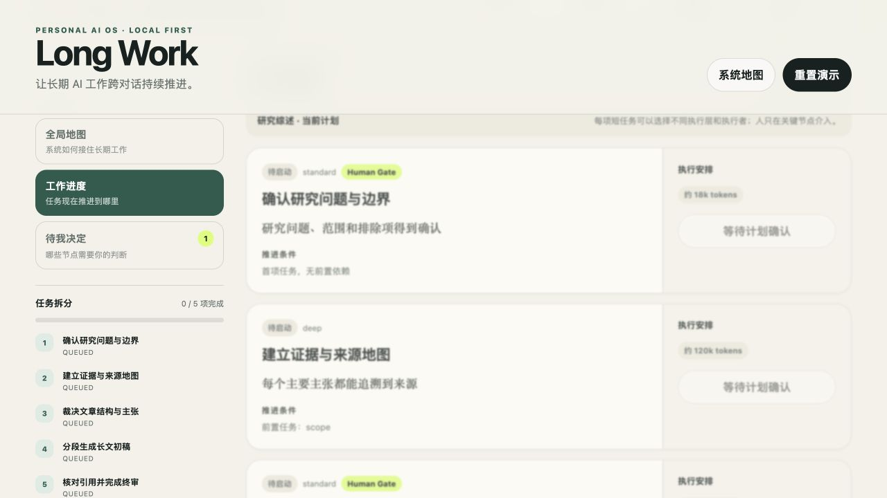
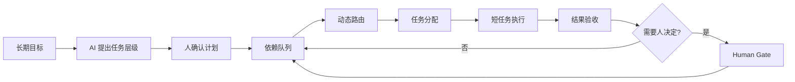

# Personal AI OS

把长期目标拆成可执行短任务，让人能看到进度、介入关键节点，并让系统持续推进。

今天的 AI 对话适合处理一个局部任务。工作一旦跨越多轮对话，新的对话需要重新核验旧内容；Plan Mode 可以生成计划，却缺少一个稳定的执行界面来承接任务、分派资源和继续下一步。

Personal AI OS 为长期工作增加一层人机协作操作面。系统提出任务层级，人确认计划；依赖满足后，任务进入动态路由和分派；需要判断时，系统停在 Human Gate；人完成裁决后，执行链从当前状态继续。

[English](README.md)



## 工作闭环



这个闭环解决四件事：

- 把长文本、科研和其他长期目标拆成有依赖、有验收条件的短任务。
- 用任务层级和进度板展示正在发生什么，避免从聊天记录恢复项目状态。
- 按任务复杂度、能力要求与上下文预算选择执行层和执行者。
- 把计划确认、关键裁决和结果验收留给人，裁决之后继续执行。

## 三板工作空间

仓库包含一个只使用合成研究任务的交互演示：

```bash
make workbench
```

然后打开 [http://127.0.0.1:8787](http://127.0.0.1:8787)。

三个板读取同一份长期任务状态：

| 主板 | 处理什么 |
|---|---|
| 全局地图 | 只读展示长期目标、任务拆解、人类裁决、动态路由、任务分配、结果验收和跨对话接续之间的关系。 |
| 工作进度 | 展示任务层级、依赖、执行者、路由、上下文预算和验收状态；前置条件满足后开放下一任务。 |
| 待我决定 | 集中处理计划确认与 Human Gate。批准后任务继续分派，退回后保持阻塞。 |

科研、长文本和其他领域工作作为任务进入工作进度，不再各自增加一个主板。界面沿用 Cognitive Intake 的纸张底色、墨绿、荧光信号、衬线标题和双栏卡片语言。

演示状态只保存在当前浏览器页面，不会读取私人工作区。

## 当前能力

| 能力 | 当前行为 |
|---|---|
| 长任务拆解 | 验证任务 ID、父子层级、依赖和验收条件；缺少依赖或出现环时阻断计划。 |
| 人类确认 | AI 生成的计划保持候选状态；人确认后才能进入执行队列。 |
| 依赖调度 | 只开放前置任务已完成、Human Gate 已通过的短任务。 |
| 动态路由 | 根据复杂度、所需能力和预计上下文选择满足要求的最小执行层。 |
| 任务分配 | 从具备能力、支持该路由且仍有容量的执行者中选择任务归属。 |
| 三板投影 | 从同一任务状态生成只读系统地图、工作进度和待裁决队列。 |
| 人类裁决 | 在计划、关键任务和结果验收处暂停，把选择权交给人。 |
| 长期运行保障 | 当前事实、连续性快照、Git 结果闭环和资产冻结用于恢复与校验。 |

## 适用场景

第一批场景来自实际工作：

- 长文本生成：研究综述、行业报告、投资材料和多章节文档；
- 科研工作：问题定义、资料检索、实验任务、证据整理和结果复核；
- 跨会话项目：需要多次模型调用、多人介入和阶段验收的工作。

每个短任务可以使用不同模型或执行者。人不需要跟随每次模型调用，只在计划、异常、关键主张和最终结果处介入。

## 动态路由与 Token Manager

动态路由已经进入当前内核。任务声明复杂度、能力要求和预计上下文，路由器选择满足条件的执行层；人工覆盖仍需通过任务要求检查。

Token Manager 是下一阶段扩展。当前任务结构和控制板已经保留 `estimated_context_tokens` 与路由窗口。后续将补充：

- 按任务预测与记录 Token 消耗；
- 达到阈值时生成检查点并压缩上下文；
- 在长任务运行中重新分配预算；
- 比较模型成本、上下文容量和执行质量。

仓库没有虚构尚未落盘的 Token Manager 实现。

## 运行内核

Python 3.10 或更高版本即可运行内核；交互控制板测试使用 Node.js。

```bash
make demo
make test
```

机器可读演示输出：

```json
{"checks":["asset_freeze","candidate_promotion","domain_route","dynamic_route","git_closure","long_task_plan","task_assignment","truth_compile","workbench_projection","workflow_transition"],"data_source":"synthetic","status":"SAFE"}
```

安装 Python API：

```bash
python3 -m pip install --no-deps -e .
personal-ai-os demo
```

## 仓库结构

```text
src/personal_ai_os/   长任务计划、路由、分配、状态与恢复合同
workbench/            可交互的合成长任务控制板
tests/                Python 与控制板行为测试
examples/             合成事实和任务记录
.github/workflows/    Python 3.10–3.12 的安装与测试
```

## 公开边界

这个仓库保留可复用产品骨架和合成演示。私人 Memory、业务材料、科研结果、真实路径、运行回执、模型账号以及本地适配器不进入仓库。

当前版本为 `0.3.0` 私有预览。公开前需要选择许可证；仓库目前没有授予复制、修改或再分发代码的许可。
