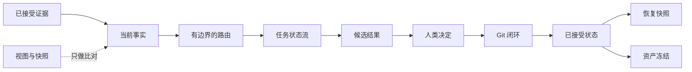

# Personal AI OS Core

**面向长期运行 AI Agent 的可恢复控制面内核。**

多数 Agent 框架关注下一次模型调用或工具执行。长期运行的 Agent 还要跨会话、跨机器、跨模型和跨人工交接，持续守住权威来源、任务边界、评审状态与恢复上下文。

Personal AI OS Core 把这些问题整理成小型、确定性的 Python 合同。事实不明确时返回 `UNKNOWN`；任务越界或结果缺少证据时返回 `BLOCKED`。

## 它解决什么问题

长期 Agent 必须可靠回答一组无法由聊天记录裁定的问题：

- 哪份证据定义当前状态，哪些文件只是展示视图？
- 当前任务允许读取哪些上下文，允许产出什么？
- 一个结果仍是候选，还是已经获得人类接受？
- 任务结果是否已保存为可评审、可回滚的版本？
- 恢复工作所需的最小状态包是什么？
- 已接受的冻结资产此后是否发生变化？

本仓库提供这些判断所需的控制面规则，适合 Agent 基础设施、本地优先 AI 工作区、多 Agent 协作与可靠性工具。

它不是模型编排框架、托管式助手、向量数据库，也不是私人工作区的打包副本。

## 控制闭环



## 运行

需要 Python 3.10 或更高版本，无运行时依赖。

```bash
make demo
make test
```

演示只使用合成数据，并输出机器可读结果：

```json
{"checks":["asset_freeze","candidate_promotion","domain_route","git_closure","truth_compile","workflow_transition"],"data_source":"synthetic","status":"SAFE"}
```

需要在仓库外调用命令时，可安装本地包：

```bash
python3 -m pip install --no-deps -e .
personal-ai-os demo
```

## 核心合同

| 模块 | 规则 |
|---|---|
| 当前事实编译 | 已接受证据可以形成当前事实；看板和快照只做视图；证据缺失或同级证据冲突时返回 `UNKNOWN`。 |
| 领域路由 | 每条路由声明领域、执行器、允许输入和允许输出；缺少路由或越界请求会停止。 |
| 任务状态流 | 状态转换显式发生，返回可追加记录的事件，并保持源任务卡不变；评审、完成和归档必须通过 Git 闭环。 |
| 候选晋升 | 候选同时具备证据和匹配的人类最终决定后，才能进入已接受状态。 |
| Git 闭环 | 结果必须绑定提交、经确认的无改动结论或外部产物引用；任务范围内仍有未提交修改时不能评审；独立候选需要明确接受才能完成。 |
| 连续性快照 | 恢复信息只保留权威、当前状态和下一动作，并生成确定性摘要。 |
| 资产冻结 | 清单记录文件摘要；文件缺失或内容变化都会阻断校验。 |

所有合同均为纯函数或本地优先逻辑，输出结构化数据。持久化、界面和供应商集成由内核外的适配器负责。

## 最小示例

```python
from personal_ai_os import evaluate_git_closure, transition_task

closure = evaluate_git_closure({
    "result_kind": "result_commit",
    "result_commit": "a1b2c3d4",
    "integration_status": "mainline",
    "dirty_paths": [],
})

result = transition_task(
    {"task_id": "demo", "status": "IN_PROGRESS", "git_closure": closure},
    "REVIEW",
    by="agent:demo",
)

assert result["ok"]
```

## 仓库结构

```text
src/personal_ai_os/   控制面合同与命令行入口
tests/                可执行的行为规范
examples/             合成清单与任务记录
.github/workflows/    Python 3.10–3.12 干净安装测试
```

## 数据边界

仓库只包含合成示例，不包含凭证、个人路径、私人记忆、业务记录、科研结果、运行日志和历史回执。模型供应商、浏览器、云存储、消息系统、实时任务看板与私人工作区适配器不属于这个核心仓库。

## 状态与许可证

当前 `0.1.0` 是可复用内核的私有预览，不是完整 Personal AI OS 运行时。仓库所有者尚未选择开源许可证；公开仓库前需要先确定许可证。
