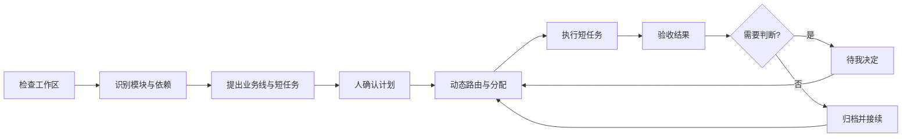

# Personal AI OS

一个面向长期 AI 工作的操作层：把能力拼成模块，把脏乱工作区拆成并行业务线，并把关键决定留给人。

目前 AI 对话擅长完成一个边界清晰的小任务。工作一旦跨越多个对话，新的对话就需要重新核验旧内容；Plan Mode 生成计划后也缺少稳定的推进机制；进度最终散落在聊天记录里。Personal AI OS 把长期目标拆成短任务，保存共享状态，并提供一个人类可以看见、介入和裁决的操作界面。

[English](README.md)


## 核心机制

Personal AI OS 不是另一套项目管理大屏。它定义的是一套 AI 工作操作系统：

- **模块地图**把认知摄取、动态路由、执行、连续性等能力做成可组合的积木，并展示真实依赖；
- **工作进度**承接总体计划和并行的科研线、产品线、写作线或自定义业务线；
- **待我决定**集中处理计划确认、任务阻塞和 Human Gate；
- **操作协议**规定下一位 AI 如何检查、建图、规划、路由、执行、验收和归档；
- **本地 CLI**为 AI、脚本和高级用户提供同一套确定性入口。

Research 属于“工作进度”中的一条业务线，不建立第二套任务事实。研究脉络的专用信息模型暂时保持开放，等产品逻辑明确后再定义。

## 工作闭环



核心不变量很简单：检查和规划阶段只生成候选，不写入目标工作区；确认之后，执行也只能发生在已接受的任务边界内。

## 三入口工作空间

运行合成交互演示：

```bash
make workbench
```

打开 [http://127.0.0.1:8787](http://127.0.0.1:8787)。

| 入口 | 处理什么 |
|---|---|
| 模块地图 | 展示模块层级、输出能力、前置依赖、组合模板和可用状态。Token Manager 明确标为规划中。 |
| 工作进度 | 展示总体阶段、多业务线、适配业务的动态排版、通用任务状态、路由、分配和验收动作。 |
| 待我决定 | 集中计划确认、阻塞处理和 Human Gate，避免关键判断消失在旧对话里。 |

页面使用合成数据，不读取私人工作区。

## 开箱即用的首次分析

本地摄取能力面向第一次拿到的新项目或脏乱仓库。它执行有边界的只读扫描，识别项目结构、文件信号与 Git 状态，提出模块、业务线和初始任务，再交给人确认。检测到未提交改动时，系统会先建立一个用于确认改动归属与保留范围的 Human Gate。

```bash
personal-ai-os inspect ./workspace
personal-ai-os modules
personal-ai-os plan ./workspace
personal-ai-os spec
```

所有命令都输出机器可读 JSON。`plan` 会返回候选业务线、初始短任务、解析后的模块图和完整操作链，不会写入被分析的工作区。

## 可组合模块

每个模块使用一个很小的声明：

```json
{
  "module_id": "dynamic-router",
  "layer": "orchestration",
  "provides": ["execution.route"],
  "requires": ["work.task"],
  "availability": "READY"
}
```

模块图会把需求连接到能力提供者；缺失能力或重复提供者会直接阻断组合。当前内置模块包括：

- 本地工作区摄取；
- Cognitive Intake；
- 长期工作内核；
- 动态路由；
- 执行适配器；
- 连续性与跨对话接续；
- 作为规划扩展的 Token Manager。

## 多业务线与极简任务创建

同一份任务状态可以针对不同工作采用不同排版：

- 科研线可以使用从左到右的阶段线和待分配任务表；
- 产品线可以使用里程碑；
- 写作线可以使用从材料到终稿的流水线。

工作空间同时提供自然语言任务入口。用户输入“整理行业资料并写一份长文初稿”，系统会先提出任务、业务线、执行层和模型路由，再把确认后的任务加入待分配队列。手动创建和未来的动态分派都使用同一份任务合同。

用户可见的通用状态包括：待分配、进行中、待验收、已阻塞、已收口、已归档和已完成。现有内核继续使用已经验证的执行状态，操作规范负责统一产品层含义。

## 当前内核能力

| 能力 | 当前行为 |
|---|---|
| 长任务拆解 | 验证父子层级、依赖、验收条件、缺失引用和循环依赖。 |
| 人类计划确认 | AI 生成的计划保持候选状态，人确认后才能执行。 |
| 依赖调度 | 只开放前置任务和 Human Gate 均满足的短任务。 |
| 动态路由 | 按复杂度、能力和上下文要求选择满足条件的最小执行层。 |
| 任务分配 | 选择能力兼容且仍有容量的执行者。 |
| 操作协议 | 固定检查 → 建图 → 规划 → 确认 → 路由 → 执行 → 验收 → 归档。 |
| 模块组合 | 解析模块提供与依赖能力，组合断裂时 fail closed。 |
| 只读摄取 | 读取本地结构并提出工作地图，不写入目标项目。 |
| 长期接续 | 当前事实、连续性快照、Git 闭环和资产冻结支持恢复与核验。 |

## 运行与测试

内核需要 Python 3.10 或更高版本；工作空间行为测试使用 Node.js。

```bash
make demo
make test
```

安装 CLI 和 Python API：

```bash
python3 -m pip install --no-deps -e .
personal-ai-os spec
```

## 仓库结构

```text
src/personal_ai_os/   计划、路由、模块、摄取、操作、状态与恢复合同
workbench/            可交互的合成 Long Work 工作空间
tests/                Python 与工作空间行为测试
examples/             合成事实和任务记录
.github/workflows/    Python 3.10–3.12 安装与测试矩阵
PRODUCT.md            长期产品边界与待定事项
```

## 公开边界

这个仓库只保留可复用产品骨架和合成演示。私人 Memory、业务材料、科研结果、真实路径、运行回执、模型账号和本地适配器不会进入仓库。

当前版本为 `0.5.0` 私有预览。公开前需要选择许可证；仓库目前没有授予法律默认权利之外的复制、修改或再分发许可。
