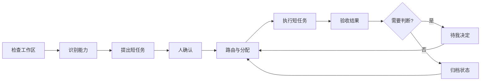

# Personal AI OS

Personal AI OS 是一个面向长期 AI 工作的本地操作层。它把长期目标拆成可独立分配的短任务，保存共享状态，并把需要判断的节点交还给人。

单个 AI 对话适合处理边界清楚的小任务。任务一旦跨越多次对话，新的对话需要重新核验旧内容；计划生成后缺少稳定的推进方式；多个执行分支也很快变得难以检查。Personal AI OS 补上长期目标和单次 AI 运行之间的操作层。

[English](README.md) · [v0.18 开发任务书](docs/DEVELOPMENT_TASKBOOK_V0.18.md) · [v0.19 开发任务书](docs/DEVELOPMENT_TASKBOOK_V0.19.md)

它不打算重复做一套通用 Agent 工具箱。浏览器、终端、定时任务、记忆、子 Agent 和远程运行已经有成熟产品。Personal AI OS 处理这些执行器之上的问题：工作区结构、可移交的任务现场、证据验收、人工决定和跨执行器连续性。

## v0.6 工作流演示

公开工作台使用匿名合成数据。页面保留工作流结构、任务数量、分配关系、运行轮次和事件轨迹，不包含任务标题、验收原文、输入材料和私人路径。

默认演示有 18 项任务，分布在三类工作流中：

- 科研线由科学假设、Protocol 设计、自主实验执行、数据分析和反馈优化五类 Agent 协作，多条实验路径可以并行推进；
- 会议纪要线从录音、演示材料和项目资料进入信息抽取、Draft、审核和定稿；
- 深度分析报告线从来源收集和证据池进入论证规划、章节写作、排版与配图。

其中 11 项已分配，3 项正在运行，2 项待验收，6 项已收口，另有 4 次重复运行保留在轨迹中。点击任一节点，可以查看 Agent、模型、执行适配器、Attempt 次数、心跳和产物事件。运行中的节点可以显示模型动物或蓝鲸女仆动画，也可以由用户关闭。

```bash
make workbench
```

打开 [http://127.0.0.1:8787](http://127.0.0.1:8787)。静态模式只使用浏览器内存，不读取本地工作区。

## v0.7 自举开发切片

本地运行时只依赖 Python 标准库和 SQLite。它保存工作流、任务、运行、事件、产物和决定，并通过有限 API 驱动同一个工作台。`personal-ai-os.runtime-plan/v1` 可以把真实本地工作线幂等同步进运行库：首次创建缺失项，之后不会重置任务状态、上下文、运行证据和结果。

实际计划应放在 Git 已忽略的 `.personal-ai-os/` 目录。这样可以让 Personal AI OS 管理自身仓库的开发，同时保证本机路径、私人项目名称和当前任务正文不会进入公开 Git。

任务的 `context` 属于服务端恢复元数据，不进入浏览器投影，也不会整体发送给模型。模型请求包含任务 envelope、最多 12,000 字符的显式 `context.model_context`，以及有界的已接受上游产物。本地路径必须留在这些模型字段和产物之外。

```bash
python3 -m pip install --no-deps -e .
personal-ai-os runtime init \
  --store .personal-ai-os/runtime.db \
  --preset science

personal-ai-os runtime sync-plan \
  --store .personal-ai-os/runtime.db \
  --plan .personal-ai-os/self-hosting-plan.private.json

export PERSONAL_AI_OS_API_BASE="https://你的兼容接口.example/v1"
export PERSONAL_AI_OS_API_KEY="只保存在本机环境变量中的密钥"
personal-ai-os runtime serve \
  --store .personal-ai-os/runtime.db \
  --model "你的模型 ID"
```

打开 [http://127.0.0.1:8787](http://127.0.0.1:8787)。API 可用时，页面会从合成演示切换到本地运行库。创建工作线和任务、启动模型、接受结果、记录裁决都会写入 SQLite。服务重启后，任务、运行轨迹和决定仍可读回。

调用 Adapter 前，运行时先原子取得任务执行权、创建本地 run，并把任务转为 `IN_PROGRESS`。同步请求未返回时，Workbench 会持续读取持久化状态，因此 working 宠物对应真实模型调用。成功响应会补入外部运行标识、产物和待验收状态；失败响应会保留为 rejected run 和阻塞任务。多个 RuntimeStore 同时竞争同一 SQLite 任务时，只有取得状态转换的一方会调用模型。

新任务不能伪造完成证据。浏览器写请求必须是同一 loopback origin 的 JSON；本机非浏览器客户端可以不携带 `Origin` 调用有限 JSON API。流式 token、取消、服务端宠物注册表、Codex / VS Code 控制、远程机器适配和整仓递归抽象仍属于后续工作。

## v0.8 有界自动推进

运行时现在可以通过一次有界、同步的命令或 API 请求，依次处理当前满足条件的短任务。任务必须处于 `QUEUED`，全部依赖已经 `DONE` 或 `ARCHIVED`，并且没有待处理决定；Adapter 调用前仍由 SQLite 原子取得执行权。

模型成功返回后只进入 `REVIEW`，系统不会代替人验收。Human Gate 只生成一张持久化决定卡；阻塞、暂停和遗留的 `IN_PROGRESS` 任务不会被重复派发；`max_steps` 为每次推进设置硬边界。

```bash
personal-ai-os runtime advance \
  --store .personal-ai-os/runtime.db \
  --workflow science \
  --adapter openai-compatible \
  --model "你的模型 ID" \
  --max-steps 25 \
  --failure-budget 1
```

工作进度页提供同一项“推进当前工作线”操作。模型调用期间，页面持续读取持久化状态，因此任务轨迹和工作宠物都来自真实运行。CLI 只有在明确省略 `--workflow` 时才执行全局推进。

v0.8 的同一次调用为选中任务使用同一组模型与 Adapter，并按稳定顺序执行。后台无人值守推进、流式、取消和外部运行中断对账仍属于后续工作。

v0.8 同时增加引用式 Domain Context 编译器。它只选择一个领域，按固定顺序装配获准的上下文引用；领域歧义或未知层级会停止，私人记忆正文不会被加载。

```bash
personal-ai-os domain-context \
  --registry examples/domain-profiles.json \
  --domain software
```

## v0.9 逐任务执行路由

自动推进现在可以从服务端版本化路由目录中，为每项任务独立选择模型与 Adapter。系统同时检查任务层级、所需能力、预计上下文长度和路线可用性，并选择满足要求的最小路线；人工指定路线也不能降低任务要求。

路由目录只保存模型与 Adapter 标识，不保存 API 密钥和服务地址。密钥继续由服务进程环境变量提供。

```bash
personal-ai-os runtime advance \
  --store .personal-ai-os/runtime.db \
  --workflow science \
  --routes examples/runtime-routes.json \
  --max-steps 25

personal-ai-os runtime serve \
  --store .personal-ai-os/runtime.db \
  --routes examples/runtime-routes.json
```

Human Gate 先于路线可用性检查。只有原子取得任务执行权的进程会登记所选路线，路线证据与真实 run ID 绑定；多个进程竞争时不会留下互相冲突的路线。多条路线共用同一 Adapter 时，每次派发只探测一次。

## v0.10 递归系统地图与工作流结构

模块地图现在先展示完整的个人 AI 操作系统：总管入口、任务级个人上下文、领域抽象、长期工作编排、领域工作系统、模型与工具执行、证据验收与交付，以及经验进入下一轮的反馈路径。真实连线继续保留在可拖动、可缩放的画布中；双击复合模块可以进入内部结构，并通过面包屑返回系统全景。

公开内核新增带版本的工作流结构，支持任务、顺序、分支、汇合、条件和有界循环六类节点。条件只能引用服务端登记的判断规则；条件结果未知时进入人工决定；循环必须设置最大轮次。当前编译器与求值器已经可以独立复用，把求值结果直接接入 RuntimeStore 与 AutoAdvance 仍属于下一阶段边界。

本地展示包可以替换工作线和任务的界面文案，但不会修改运行库事实。它只接受工作线名称、说明、目标，有长度限制的任务标签、标题、验收条件和角色名称，以及 `sequence / branch / join / condition / loop` 五类仅供展示的结构提示。结构提示只改变工作流阅读器，不参与调度或任务状态判断。浏览器可见的工作线、任务、领域、分组、能力、运行、产物、事件和决定标识会替换成稳定的顺序别名，用户操作再由服务端还原到运行事实；运行上下文、本机路径、Git 收口信息、凭据和模型载荷都会被拒绝。

```bash
personal-ai-os runtime serve \
  --store .personal-ai-os/runtime.db \
  --model "你的模型 ID" \
  --presentation examples/presentation.zh-CN.json
```

## v0.11 单线路聚焦与本地投影边界

工作进度现在先按 Domain 分组，再展示当前 Domain 下的工作线。页面只保留选中工作线的任务和运行轨迹；切换 Domain 或工作线只改变投影，不改变任务状态。执行设置集中在后台入口；没有可用执行适配器时，工作线和任务两个运行入口都会明确禁用。

模块地图把结构依赖和反馈关系分开。选中模块后，可以直接查看外部输入、内部处理、主要输出、接口协议、运行边界和可下钻子图。

本地服务使用两种明确的投影模式：

- `private-local` 保留单人本地运行所需的真实任务文案，并且只允许绑定 loopback 地址；
- `public-safe` 必须提供已验证的展示包；工作线、任务、模型、Adapter、路由和分配标识使用稳定公开别名，Adapter 协议细节与私人文案不进入浏览器投影。

两种模式都只返回固定字段的 Adapter 目录、服务端真实的固定运行/自动路由就绪状态和稳定错误原因。`private-local` 是本机信任边界，不能作为局域网或公网发布模式。

```bash
personal-ai-os runtime serve \
  --store .personal-ai-os/runtime.db \
  --model "你的模型 ID" \
  --projection-mode private-local
```

## v0.12 持久目标与有界续推

持久目标位于单条工作线之上。SQLite 单独保存目标、覆盖的工作线、完成条件、续推预算、累计步数、已观测模型 Token 和追加式目标事件。服务重启后，系统直接读取目标事实，不需要再从聊天内容猜测目标。

目标续推继续经过现有依赖检查、Human Gate、动态路由、任务原子占用、结果验收和恢复边界。一次续推可以覆盖多条已登记工作线，但同时受单次步数和总预算限制。达到步数或 Token 上限只进入 `BUDGET_LIMITED`；全部范围任务收口只进入 `AWAITING_ACCEPTANCE`。两者都不等于完成。只有用户提供验收依据并明确确认后，目标才进入 `COMPLETE`。

```bash
personal-ai-os runtime goal-create \
  --store .personal-ai-os/runtime.db \
  --goal examples/durable-goal.json

personal-ai-os runtime goal-continue \
  --store .personal-ai-os/runtime.db \
  --goal-id goal:science-release \
  --adapter openai-compatible \
  --model "你的模型 ID"
```

私人本地工作台在 Domain 与工作线分页上方显示当前长期目标、持久预算使用量和一个续推动作。SQLite 续推占用保证同一目标只有一个续推方。进程崩溃留下的未结束占用会返回 `GOAL_RECOVERY_REQUIRED`，等待恢复确认，不会盲目重放外部动作。

本切片在研究 Prime Agent、LangGraph、OpenHands、Letta Code 和 LoopX 后独立实现通用机制，不复制第三方源码、界面、商标或品牌素材。许可证边界见[参考项目许可证说明](docs/REFERENCE_PROJECT_LICENSES_V0.12.md)。

## v0.13 工作方式与模块—任务勾稽

“脑”的通用底座现在可以保存个人或团队在某个领域下的工作方式候选。候选必须带证据并从 `PROPOSED` 开始；只有记录了审核主体的显式审核才能成为 `APPROVED`，审核决定会追加保存。模型上下文只加载与当前任务主体和领域同时匹配的已确认规则；规则数量、单条长度和合并后的模型上下文均有上限。公开内核不会从对话自动推断人格，也不会自动提升记忆。

“手”的任务卡现在可以通过版本化关系连接到正在建设、修改、使用、验证或阻塞它的系统模块。已确认关系同时进入工作进度和模块地图；自动分析只生成候选关系，未关联任务保持单独可见。用户从模块批注创建任务时，选中的模块标识会一直保留。

```bash
personal-ai-os runtime memory-propose \
  --store .personal-ai-os/runtime.db \
  --candidate ./memory-candidate.private.json

personal-ai-os runtime memory-review \
  --store .personal-ai-os/runtime.db \
  --candidate-id candidate:writing:001 \
  --decision APPROVED \
  --by owner
```

私人旧任务卡的接入保留在私人仓库中，由只读适配器生成通用 envelope、去重键和状态差异清单；预览阶段不会写入运行库或改变卡片状态。对话自动采集、经验自动批准、能力自安装和整仓递归理解仍未交付。竞品机制与许可证条件见 [v0.13 参考项目说明](docs/REFERENCE_PROJECT_LICENSES_V0.13.md)。

## v0.14 工作协议、后台设置与跨层连接

工作流现在可以指定版本化的 `personal-ai-os.work-protocols/v1` 工作协议。Broker 会在领取运行权、创建 run 和调用模型之前解析协议。指定协议缺失时返回 `WORK_PROTOCOL_REQUIRED`，任务保持 `QUEUED`，不会产生 run 或模型调用。协议只保存有界的指令引用、模板引用、执行规则、个人或团队记忆主体，以及任务后的经验复核策略。

内置会议纪要线绑定“来源优先的完整记录”协议：原始逐字记录是事实来源，章节遵循自然讨论顺序，数字与归因完整保留，不会静默降级为精简摘要。协议会自动加载对应团队与领域已经确认的工作习惯。成功运行只登记一项经验复核请求；新的习惯仍先成为有证据的候选，经明确审核后才进入后续任务上下文。

```bash
personal-ai-os runtime serve \
  --store .personal-ai-os/runtime.db \
  --routes examples/runtime-routes.json \
  --protocols .personal-ai-os/work-protocols.private.json
```

模型、路由、执行适配器和 API 配置已经移到后台“设置”。工作进度只保留开始、继续、验收和裁决。固定模式由服务端保存唯一默认执行适配器，自动模式按路线目录选择；浏览器不能用排序靠前的其他适配器覆盖设置。密钥只从服务端环境变量读取，不进入浏览器。仅配置自动路由的本地服务也可以直接从任务卡开始运行，不再要求用户在任务详情中重复选模型。

模块地图现在区分“系统全景”和“组件依赖”。系统全景解释整个操作架构与可下钻的内部结构；组件依赖解释实际安装模块的 capability 供需关系。下钻后的子图保留所属上层模块，以及跨层输入、输出和反馈交接，内部模块不会再显示成孤立结构。

## v0.18 强制读取记忆与仅复核学习

任务可以在 `context.memory_policy` 中声明 `"require_read"`，要求运行前读取已经批准的工作方式。任务必须明确提供 `memory_refs`、`memory_subject` 和与任务领域一致的 `memory_domain_id`。引用缺失、未批准、来源未绑定、上下文超限或范围不匹配时，Broker 在领取运行权之前返回稳定错误，任务保持 `QUEUED`。

Broker 在领取运行权之前调用 source-agnostic 的 `read_memory_context` 合同，读取显式提供的 `registered_memory_refs` 索引；本地候选表也只能通过同一套有界投影接入。发送给模型的执行上下文只带入选中的、有界引用及其事实/决定摘要。成功运行只登记 `CANDIDATE` 状态的 `MEMORY_REVIEW_REQUESTED`，不会写入、批准或提升记忆候选。未声明该策略的历史任务继续沿用兼容路径。

公开核心另提供独立的 `personal-ai-os.practice-candidate/v1` 引用式合同，供适配器预览工作方式候选。它只携带候选引用、有限来源引用、匿名的主体/领域范围引用和人工审核状态，不包含工作方式正文、路径、业务标签或凭据。`PROPOSED` 表示尚未审核；`APPROVED` 和 `REJECTED` 必须带审核者引用。纯校验器不会写入长期记忆，也不会自动批准候选；该合同同样受仓库 [PolyForm Noncommercial 许可证](LICENSE) 约束。

最小的合成引用式示例位于 [`examples/practice_candidate.synthetic.json`](examples/practice_candidate.synthetic.json)。下面的命令只做校验，不会写入运行库：

```bash
PYTHONPATH=src python3 - <<'PY'
import json
from pathlib import Path
from personal_ai_os import validate_practice_candidate

payload = json.loads(Path("examples/practice_candidate.synthetic.json").read_text())
print(validate_practice_candidate(payload))
PY
```

当前公开测试覆盖为 304 个 Python 测试和 89 个 Workbench 测试（`make test`）。

公开核心另提供 `personal-ai-os.execution-receipt/v1` 通用只读交接合同，用于表达项目归属的执行结果。绑定部分只保存不透明的 `project_id`、`thread_id`、`host_id` 引用和明确的验证标记；回执部分保存终态、结果、有界产物引用和最终输出引用，不携带输出正文。已完成回执必须经过验证、不能仍在等待用户输入或人工裁决，并且必须带最终输出引用；路径、业务标签和凭据会被拒绝。`validate_execution_receipt` 是纯函数，不会写入运行状态。

任务路由保持为可替换的执行边界合同。任务只声明复杂度层级
（`complexity`）、所需能力，以及可选的
`context.routing.estimated_context_tokens` 上下文预算。
`task_route_requirements()` 负责规范化这些声明；任务中出现模型、Adapter
或路线等运行时绑定字段时会直接阻断。模型和 Adapter 只来自服务端持有的
版本化路线目录。声明无效或没有可用路线时，系统在领取运行权前停止，不会
留下半成品执行记录。

## v0.19 有界运行连续性

每项任务的验收投影现在附带一份 `personal-ai-os.continuity/v2` 恢复胶囊。它只保留任务与依赖状态、最新运行引用、最新决定引用、有界产物引用和一条下一步动作；任务正文、模型输出、本地路径和凭据会在构建前被过滤。胶囊是纯函数并带稳定摘要，可以交给下一次执行读取，但不会自行恢复任务、接受结果或批准记忆候选。

公开安全投影沿用现有稳定别名，因此恢复胶囊不会重新暴露真实标识。该能力复用现有运行库、连续性原语和只读内存读取边界，不新增数据库、后台守护进程或隐式重试。

## 操作闭环



检查和规划只生成候选。确认之后，系统才允许在已接受的任务边界内执行。运行时只有持久化本地 run 并取得任务执行权后才进入运行状态；只修改界面标签不算执行。

## 三个固定入口

| 入口 | 负责什么 |
|---|---|
| 模块地图 | 在可拖动、可缩放的拓扑中查看系统全景、模块内部结构、真实依赖、输入输出、反馈关系、可用状态和可替换插槽；模块批注可转成当前工作流中的修正任务。 |
| 工作进度 | 查看任务数量、分配情况、Loop、并行分支、重复运行和节点轨迹。 |
| 待我决定 | 集中处理计划确认、阻塞和 Human Gate。 |

这是一套操作界面，不是管理大屏。系统用状态转换、运行事件、产物和人工验收证明任务确实在运转。功能数量和页面包装不能替代可运行的闭环。

## 即插即用模块

模块通过 capability 名称连接，不直接引用其他模块。每个模块提供一个带版本的 manifest：

```json
{
  "contract_version": "personal-ai-os.module/v1",
  "module_id": "local-exporter",
  "name": "Local Exporter",
  "layer": "output",
  "summary": "Exports an artifact reference.",
  "provides": ["artifact.export"],
  "requires": ["execution.result"],
  "availability": "READY",
  "optional": true,
  "entrypoint": "local_exporter:activate"
}
```

`discover_module_manifests()` 读取模块目录下一层的 `module.json`，不会导入或执行插件代码。`build_module_graph()` 负责解析能力提供者，报告缺失或重复接口，并拒绝模块之间的直接引用。新增或移除合法 manifest 时，工作台布局不需要跟着修改。

```bash
personal-ai-os modules --directory examples/modules
```

内置模块包括有边界的工作区摄取、Cognitive Intake、工作流状态、动态路由、执行适配、连续性，以及规划中的 Token Manager 插槽。

## 本地 CLI

```bash
personal-ai-os inspect ./workspace
personal-ai-os modules
personal-ai-os plan ./workspace
personal-ai-os spec
```

命令统一输出机器可读 JSON。`inspect` 和 `plan` 保持只读；Git 工作区存在未提交改动时，系统会建立明确的人类确认边界，不会静默吸收这些内容。

## 内核能力

| 能力 | 行为 |
|---|---|
| 长任务拆解 | 检查父子层级、依赖、验收条件、缺失引用和循环依赖。 |
| 人类确认 | AI 生成的计划保持候选状态，人确认后才能执行。 |
| 依赖调度 | 只开放前置任务和 Human Gate 均满足的短任务。 |
| 有界自动推进 | 每项就绪任务只派发一次，记录选择与结果，并在待验收、待决定、阻塞、恢复门或步数上限处停止。 |
| 逐任务执行路由 | 自动推进按能力、层级和上下文要求选择最小可用路线，并与成功取得执行权的 run 原子绑定。 |
| 递归系统认知 | 从总管入口一直读到交付与反馈，支持真实连线、拖动、缩放、面包屑和模块内部下钻。 |
| 结构化工作流 | 校验并计算任务、顺序、分支、汇合、条件和有界循环，不执行任意代码。 |
| 有证据的工作方式 | 保存个人或团队的经验候选，只在人工确认且主体、领域匹配时加载。 |
| 模块—任务勾稽 | 用明确关系连接任务与系统模块，并派生已关联工作和孤立任务。 |
| 本地展示投影 | 通过严格白名单替换工作线和任务文案，不把私人运行事实写进公开仓或浏览器载荷。 |
| Domain Context 编译 | 按固定引用白名单只加载一个领域；歧义和未知层级直接停止。 |
| 任务分配 | 选择能力兼容且仍有容量的执行者。 |
| 模块组合 | 解析带版本的 capability manifest，组合断裂时停止。 |
| 模块问题交接 | 把选中模块的批注转成可持久、可分派的任务，不建立第二套任务系统。 |
| 只读摄取 | 读取本地结构并提出工作地图，不写入目标项目。 |
| 连续接续 | 保存下一次运行恢复和核验所需的状态。 |
| 持久化运行时 | 用 SQLite 保存任务、运行、事件、产物和决定，并支持重启后重放。 |
| 本地计划同步 | 幂等导入带版本的本地工作计划，不覆盖已经发生的运行事实。 |
| 秘书简报 | 从同一状态生成进行中、待验收、阻塞和下一动作摘要，不复制私人记忆正文。 |
| 兼容模型适配 | 通过已配置的 Chat Completions-compatible 接口执行一个有边界的短任务。 |
| 可选工作宠物 | 只在持久化任务运行时按需显示蓝鲸女仆 GIF 或模型动物，用户可随时关闭。 |

## 安装与测试

内核需要 Python 3.10 或更高版本；工作台行为测试使用 Node.js。

```bash
python3 -m pip install --no-deps -e .
make demo
make test
```

## 仓库结构

```text
src/personal_ai_os/   计划、路由、运行时、Adapter、秘书层、模块、状态与恢复合同
workbench/            可连接本地运行库的工作台，并保留匿名静态演示
tests/                Python 与工作台行为测试
examples/             合成状态记录和示例模块 manifest
.github/workflows/    Python 3.10-3.12 安装与测试矩阵
PRODUCT.md            稳定的产品边界
docs/DEVELOPMENT_TASKBOOK_V0.10.md 递归系统地图与工作流结构验收任务书
docs/REPOSITORY_ACCEPTANCE_V0.6.zh-CN.md  v0.6 封包验收边界
```

## 公开边界与许可证

这个仓库只包含可复用的产品骨架和合成演示。私人 Memory、输入材料、个人路径、运行回执、模型账号、凭据和本地适配器不会进入仓库。

代码以 [PolyForm Noncommercial 1.0.0](LICENSE) 提供：许可证定义范围内的个人与非商业用途可以使用、修改和分发，并须保留版权声明。商业用途需要取得 Dengk3Li 单独签署的付费许可并署名；当前不提供公开商业联系入口，未签署商业许可前不授予商业使用权。详见[商业使用说明](COMMERCIAL_USE.md)。
