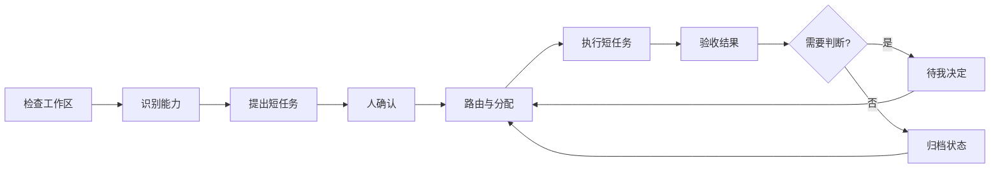

# Personal AI OS

Personal AI OS 是一个面向长期 AI 工作的本地操作层。它把长期目标拆成可独立分配的短任务，保存共享状态，并把需要判断的节点交还给人。

单个 AI 对话适合处理边界清楚的小任务。任务一旦跨越多次对话，新的对话需要重新核验旧内容；计划生成后缺少稳定的推进方式；多个执行分支也很快变得难以检查。Personal AI OS 补上长期目标和单次 AI 运行之间的操作层。

[English](README.md) · [v0.9 开发任务书](docs/DEVELOPMENT_TASKBOOK_V0.9.md)

它不打算重复做一套通用 Agent 工具箱。浏览器、终端、定时任务、记忆、子 Agent 和远程运行已经有成熟产品。Personal AI OS 处理这些执行器之上的问题：工作区结构、可移交的任务现场、证据验收、人工决定和跨执行器连续性。

## v0.6 工作流演示

公开工作台使用匿名合成数据。页面保留工作流结构、任务数量、分配关系、运行轮次和事件轨迹，不包含任务标题、验收原文、输入材料和私人路径。

默认演示有 18 项任务，分布在三类工作流中：

- 科研线由科学假设、Protocol 设计、自主实验执行、数据分析和反馈优化五类 Agent 协作，多条实验路径可以并行推进；
- 会议纪要线从录音、演示材料和项目资料进入信息抽取、Draft、审核和定稿；
- 深度分析报告线从来源收集和证据池进入论证规划、章节写作、排版与配图。

其中 11 项已分配，3 项正在运行，2 项待验收，6 项已收口，另有 4 次重复运行保留在轨迹中。点击任一节点，可以查看 Agent、模型、执行适配器、Attempt 次数、心跳和产物事件。运行中的节点可以显示模型动物或蓝鲸女仆动画，也可以由用户关闭。

```bash
make workbench
```

打开 [http://127.0.0.1:8787](http://127.0.0.1:8787)。静态模式只使用浏览器内存，不读取本地工作区。

## v0.7 自举开发切片

本地运行时只依赖 Python 标准库和 SQLite。它保存工作流、任务、运行、事件、产物和决定，并通过有限 API 驱动同一个工作台。`personal-ai-os.runtime-plan/v1` 可以把真实本地工作线幂等同步进运行库：首次创建缺失项，之后不会重置任务状态、上下文、运行证据和结果。

实际计划应放在 Git 已忽略的 `.personal-ai-os/` 目录。这样可以让 Personal AI OS 管理自身仓库的开发，同时保证本机路径、私人项目名称和当前任务正文不会进入公开 Git。

任务的 `context` 属于服务端恢复元数据，不进入浏览器投影，也不会整体发送给模型。模型请求包含任务 envelope、最多 12,000 字符的显式 `context.model_context`，以及有界的已接受上游产物。本地路径必须留在这些模型字段和产物之外。

```bash
python3 -m pip install --no-deps -e .
personal-ai-os runtime init \
  --store .personal-ai-os/runtime.db \
  --preset science

personal-ai-os runtime sync-plan \
  --store .personal-ai-os/runtime.db \
  --plan .personal-ai-os/self-hosting-plan.private.json

export PERSONAL_AI_OS_API_BASE="https://你的兼容接口.example/v1"
export PERSONAL_AI_OS_API_KEY="只保存在本机环境变量中的密钥"
personal-ai-os runtime serve \
  --store .personal-ai-os/runtime.db \
  --model "你的模型 ID"
```

打开 [http://127.0.0.1:8787](http://127.0.0.1:8787)。API 可用时，页面会从合成演示切换到本地运行库。创建工作线和任务、启动模型、接受结果、记录裁决都会写入 SQLite。服务重启后，任务、运行轨迹和决定仍可读回。

调用 Adapter 前，运行时先原子取得任务执行权、创建本地 run，并把任务转为 `IN_PROGRESS`。同步请求未返回时，Workbench 会持续读取持久化状态，因此 working 宠物对应真实模型调用。成功响应会补入外部运行标识、产物和待验收状态；失败响应会保留为 rejected run 和阻塞任务。多个 RuntimeStore 同时竞争同一 SQLite 任务时，只有取得状态转换的一方会调用模型。

新任务不能伪造完成证据。浏览器写请求必须是同一 loopback origin 的 JSON；本机非浏览器客户端可以不携带 `Origin` 调用有限 JSON API。流式 token、取消、服务端宠物注册表、Codex / VS Code 控制、远程机器适配和整仓递归抽象仍属于后续工作。

## v0.8 有界自动推进

运行时现在可以通过一次有界、同步的命令或 API 请求，依次处理当前满足条件的短任务。任务必须处于 `QUEUED`，全部依赖已经 `DONE` 或 `ARCHIVED`，并且没有待处理决定；Adapter 调用前仍由 SQLite 原子取得执行权。

模型成功返回后只进入 `REVIEW`，系统不会代替人验收。Human Gate 只生成一张持久化决定卡；阻塞、暂停和遗留的 `IN_PROGRESS` 任务不会被重复派发；`max_steps` 为每次推进设置硬边界。

```bash
personal-ai-os runtime advance \
  --store .personal-ai-os/runtime.db \
  --workflow science \
  --adapter openai-compatible \
  --model "你的模型 ID" \
  --max-steps 25 \
  --failure-budget 1
```

工作进度页提供同一项“推进当前工作线”操作。模型调用期间，页面持续读取持久化状态，因此任务轨迹和工作宠物都来自真实运行。CLI 只有在明确省略 `--workflow` 时才执行全局推进。

v0.8 的同一次调用为选中任务使用同一组模型与 Adapter，并按稳定顺序执行。后台无人值守推进、流式、取消和外部运行中断对账仍属于后续工作。

v0.8 同时增加引用式 Domain Context 编译器。它只选择一个领域，按固定顺序装配获准的上下文引用；领域歧义或未知层级会停止，私人记忆正文不会被加载。

```bash
personal-ai-os domain-context \
  --registry examples/domain-profiles.json \
  --domain software
```

## v0.9 逐任务执行路由

自动推进现在可以从服务端版本化路由目录中，为每项任务独立选择模型与 Adapter。系统同时检查任务层级、所需能力、预计上下文长度和路线可用性，并选择满足要求的最小路线；人工指定路线也不能降低任务要求。

路由目录只保存模型与 Adapter 标识，不保存 API 密钥和服务地址。密钥继续由服务进程环境变量提供。

```bash
personal-ai-os runtime advance \
  --store .personal-ai-os/runtime.db \
  --workflow science \
  --routes examples/runtime-routes.json \
  --max-steps 25

personal-ai-os runtime serve \
  --store .personal-ai-os/runtime.db \
  --routes examples/runtime-routes.json
```

Human Gate 先于路线可用性检查。只有原子取得任务执行权的进程会登记所选路线，路线证据与真实 run ID 绑定；多个进程竞争时不会留下互相冲突的路线。多条路线共用同一 Adapter 时，每次派发只探测一次。

## 操作闭环



检查和规划只生成候选。确认之后，系统才允许在已接受的任务边界内执行。运行时只有持久化本地 run 并取得任务执行权后才进入运行状态；只修改界面标签不算执行。

## 三个固定入口

| 入口 | 负责什么 |
|---|---|
| 模块地图 | 在可拖动、可缩放的全局拓扑中查看模块层级、真实依赖、上下游关系、可用状态和可替换插槽；模块批注可转成当前工作流中的修正任务。 |
| 工作进度 | 查看任务数量、分配情况、Loop、并行分支、重复运行和节点轨迹。 |
| 待我决定 | 集中处理计划确认、阻塞和 Human Gate。 |

这是一套操作界面，不是管理大屏。系统用状态转换、运行事件、产物和人工验收证明任务确实在运转。功能数量和页面包装不能替代可运行的闭环。

## 即插即用模块

模块通过 capability 名称连接，不直接引用其他模块。每个模块提供一个带版本的 manifest：

```json
{
  "contract_version": "personal-ai-os.module/v1",
  "module_id": "local-exporter",
  "name": "Local Exporter",
  "layer": "output",
  "summary": "Exports an artifact reference.",
  "provides": ["artifact.export"],
  "requires": ["execution.result"],
  "availability": "READY",
  "optional": true,
  "entrypoint": "local_exporter:activate"
}
```

`discover_module_manifests()` 读取模块目录下一层的 `module.json`，不会导入或执行插件代码。`build_module_graph()` 负责解析能力提供者，报告缺失或重复接口，并拒绝模块之间的直接引用。新增或移除合法 manifest 时，工作台布局不需要跟着修改。

```bash
personal-ai-os modules --directory examples/modules
```

内置模块包括有边界的工作区摄取、Cognitive Intake、工作流状态、动态路由、执行适配、连续性，以及规划中的 Token Manager 插槽。

## 本地 CLI

```bash
personal-ai-os inspect ./workspace
personal-ai-os modules
personal-ai-os plan ./workspace
personal-ai-os spec
```

命令统一输出机器可读 JSON。`inspect` 和 `plan` 保持只读；Git 工作区存在未提交改动时，系统会建立明确的人类确认边界，不会静默吸收这些内容。

## 内核能力

| 能力 | 行为 |
|---|---|
| 长任务拆解 | 检查父子层级、依赖、验收条件、缺失引用和循环依赖。 |
| 人类确认 | AI 生成的计划保持候选状态，人确认后才能执行。 |
| 依赖调度 | 只开放前置任务和 Human Gate 均满足的短任务。 |
| 有界自动推进 | 每项就绪任务只派发一次，记录选择与结果，并在待验收、待决定、阻塞、恢复门或步数上限处停止。 |
| 逐任务执行路由 | 自动推进按能力、层级和上下文要求选择最小可用路线，并与成功取得执行权的 run 原子绑定。 |
| Domain Context 编译 | 按固定引用白名单只加载一个领域；歧义和未知层级直接停止。 |
| 任务分配 | 选择能力兼容且仍有容量的执行者。 |
| 模块组合 | 解析带版本的 capability manifest，组合断裂时停止。 |
| 模块问题交接 | 把选中模块的批注转成可持久、可分派的任务，不建立第二套任务系统。 |
| 只读摄取 | 读取本地结构并提出工作地图，不写入目标项目。 |
| 连续接续 | 保存下一次运行恢复和核验所需的状态。 |
| 持久化运行时 | 用 SQLite 保存任务、运行、事件、产物和决定，并支持重启后重放。 |
| 本地计划同步 | 幂等导入带版本的本地工作计划，不覆盖已经发生的运行事实。 |
| 秘书简报 | 从同一状态生成进行中、待验收、阻塞和下一动作摘要，不复制私人记忆正文。 |
| 兼容模型适配 | 通过已配置的 Chat Completions-compatible 接口执行一个有边界的短任务。 |
| 可选工作宠物 | 只在持久化任务运行时按需显示蓝鲸女仆 GIF 或模型动物，用户可随时关闭。 |

## 安装与测试

内核需要 Python 3.10 或更高版本；工作台行为测试使用 Node.js。

```bash
python3 -m pip install --no-deps -e .
make demo
make test
```

## 仓库结构

```text
src/personal_ai_os/   计划、路由、运行时、Adapter、秘书层、模块、状态与恢复合同
workbench/            可连接本地运行库的工作台，并保留匿名静态演示
tests/                Python 与工作台行为测试
examples/             合成状态记录和示例模块 manifest
.github/workflows/    Python 3.10-3.12 安装与测试矩阵
PRODUCT.md            稳定的产品边界
docs/DEVELOPMENT_TASKBOOK_V0.9.md  逐任务路由与运行证据验收任务书
docs/REPOSITORY_ACCEPTANCE_V0.6.zh-CN.md  v0.6 封包验收边界
```

## 公开边界与许可证

这个仓库只包含可复用的产品骨架和合成演示。私人 Memory、输入材料、个人路径、运行回执、模型账号、凭据和本地适配器不会进入仓库。

代码以 [PolyForm Noncommercial 1.0.0](LICENSE) 提供：许可证定义范围内的个人与非商业用途可以使用、修改和分发，并须保留版权声明。商业用途需要取得 Dengk3Li 单独签署的付费许可并署名；当前不提供公开商业联系入口，未签署商业许可前不授予商业使用权。详见[商业使用说明](COMMERCIAL_USE.md)。
