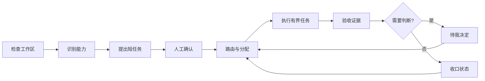

# Personal AI OS

Personal AI OS 是一个面向长期 AI 工作的本地优先操作层。它把长期目标拆成可分配的短任务，保存任务在不同运行之间的工作现场，并把需要判断的节点交还给人。

单个 AI 对话适合处理边界清楚的小任务。长期工作需要独立的控制层：任务能够排序、分支、恢复、分配给不同执行器，并依据证据完成验收。Personal AI OS 提供这一层，不替代实际执行工作的模型、工具和工作区。

[English](README.md) · [版本记录](CHANGELOG.md) · [产品边界](PRODUCT.md)

## 产品模型

系统由两个相互协作的表面组成：

- **脑**：按领域加载上下文，管理已确认的工作方式、任务历史和有证据的连续性。
- **手**：管理任务卡、依赖调度、模型与工具适配器、运行回执、人工裁决和有界续推。

浏览器是可替换的展示层。SQLite 与运行时合同是任务状态、运行、事件、产物和决定的事实来源。

## 操作闭环



检查和规划只生成候选。任务经过确认、依赖满足，并由运行时为可用适配器取得执行权后才开始执行。模型成功返回后停留在待验收状态，系统不会替用户批准自己的工作。

## 工作台

公开 Workbench 使用匿名合成数据，产品表面聚焦于三个稳定入口：

| 入口 | 作用 |
|---|---|
| 模块地图 | 查看操作架构、已安装模块的能力依赖、输入、输出、反馈关系和递归模块详情。 |
| 工作进度 | 按领域和工作线查看任务分配、分支、循环、运行轮次和选中任务的执行轨迹。 |
| 待我决定 | 集中处理计划确认、阻塞任务、人工裁决和需要人工执行的下一动作。 |

任务详情是验收界面，可以显示前置条件、最近登记的结果、产出时间，以及裁决对后续工作的影响。公开安全投影不会把任务正文和私人产物放入浏览器。

```bash
make workbench
```

打开 [http://127.0.0.1:8787](http://127.0.0.1:8787)。静态演示只使用浏览器内存，不读取本地工作区。

## 本地运行时

可选的本地运行时使用 Python 与 SQLite，通过有限 JSON API 驱动同一个 Workbench，并持久保存工作流、任务、运行、事件、产物、决定和长期目标。

```bash
python3 -m pip install --no-deps -e .
personal-ai-os runtime init \
  --store .personal-ai-os/runtime.db \
  --preset science

personal-ai-os runtime serve \
  --store .personal-ai-os/runtime.db \
  --routes examples/runtime-routes.json \
  --projection-mode private-local
```

API 密钥只保存在服务进程环境中。运行上下文、本机路径、Git 收口信息、凭据和私人任务正文不会进入公开 Git 或公开安全浏览器投影。实际计划和路由凭据应放在 Git 忽略的 `.personal-ai-os/` 目录中。

运行时支持有界续推、逐任务路由、人工裁决、恢复停止、证据验收和可选的模型宠物。流式输出、取消、远程机器适配、自动批准记忆和无人值守后台调度仍是明确的扩展接口。

## 即插即用模块合同

模块通过命名能力连接，而不是相互导入。每个模块声明一个版本化清单：

```json
{
  "contract_version": "personal-ai-os.module/v1",
  "module_id": "local-exporter",
  "name": "Local Exporter",
  "layer": "output",
  "summary": "Exports an artifact reference.",
  "provides": ["artifact.export"],
  "requires": ["execution.result"],
  "availability": "READY",
  "optional": true,
  "entrypoint": "local_exporter:activate"
}
```

模块图会解析能力提供方，报告缺失或重复接口，并支持递归查看。新增或移除有效清单不需要修改 Workbench 布局。

```bash
personal-ai-os modules --directory examples/modules
```

## 本地 CLI

```bash
personal-ai-os inspect ./workspace
personal-ai-os modules
personal-ai-os plan ./workspace
personal-ai-os spec
```

这些命令输出机器可读 JSON。`inspect` 和 `plan` 保持只读；工作区存在未提交改动时，系统会明确呈现人工边界，不会静默吸收。

## 仓库结构

```text
src/personal_ai_os/   规划、路由、运行时、适配器、秘书、模块、状态与恢复合同
workbench/            交互式运行客户端与匿名静态回退
tests/                Python 与 Workbench 行为测试
examples/             合成状态记录与模块清单示例
docs/                 版本化任务书、验收记录、产品研究与许可证说明
```

每个版本的具体变更放在 [CHANGELOG.md](CHANGELOG.md) 和 [`docs/`](docs/) 下的对应文档中，不在 README 中堆叠版本说明。

## 公开边界与许可证

本仓库包含可复用的产品骨架和合成演示。私人记忆、原始材料、本机路径、运行回执、模型账号、凭据和本地适配器留在仓库之外。

代码采用 [PolyForm Noncommercial License 1.0.0](LICENSE)。在该许可证范围内，个人和非商业使用需保留版权声明。商业使用需要与 Dengk3Li 单独签署付费许可并保留署名。目前未提供公开商业联系入口，未签署单独许可前不授予商业权利。详见 [商业使用说明](COMMERCIAL_USE.md)。
