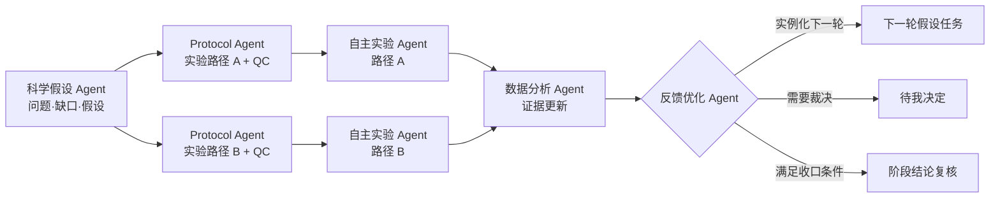
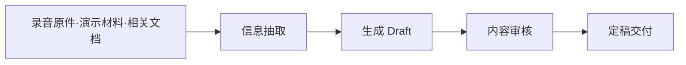
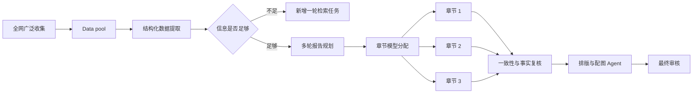

# Personal AI OS v0.6 开发任务书

## 目标

v0.6 要把当前的合成 Long Work 演示推进为一个本地可运行的个人 AI 操作层：界面动作能够调用受控 API，任务能够进入真实模型或工具，运行状态能够回到任务卡，用户能够查看每一步做过什么，并在关键节点改变模型、流程或决策。

这一版的成功标准不是增加更多看板，而是打通一条最小真实闭环：

> 创建任务 → 选择或自动匹配模型 → 启动真实运行 → 展示运行进度与宠物动画 → 收集结果 → 人工验收 → 继续下一个节点

## 当前 0.6 封包范围

当前公开实现同时提供两种明确分开的模式：

- 静态 Workbench 使用 18 项匿名合成任务，只展示结构、分配、运行轮次和目标事件形态；
- 本地 runtime 使用 SQLite 保存工作流、任务、运行、事件、产物和决定，并通过有限 HTTP API 驱动同一个 Workbench；
- Execution Broker 已接通同步 OpenAI-compatible Chat Completions Adapter；只有取得外部运行 ID 后任务才进入 `IN_PROGRESS`；
- 成功的终态模型输出写入本地 `artifacts`，运行与事件持久化，任务随后进入 `REVIEW` 等待人工验收；
- Secretary 已交付 `context-pack/v1` 与 `secretary-brief/v1`，从运行库生成最小交接上下文、注意事项和下一动作；
- 模块地图使用 `personal-ai-os.module/v1` manifest，支持拖动节点、平移、缩放、视口适配、完整上下游聚焦，以及模块批注转修正任务；
- 内置预设为 science、meeting notes 和 analytical report；用户也可以通过运行 API 创建工作流和任务。

当前 runtime 不提供 SSE、后台流式执行、运行取消或续接、Codex App Server / VS Code 控制、模型目录发现或自动全仓分形扫描。静态演示中的心跳、宠物和流式事件不能解释为这些能力已经可用。

## 当前能力验收

当前公开版是可运行的本地 MVP，同时保留匿名静态演示。

| 入口或动作 | 当前实际行为 | 当前边界 |
|---|---|---|
| 模块地图 | 从 manifest 生成分层依赖拓扑；支持真实连线、拖动、平移、缩放、Fit、Reset、上下游聚焦和批注转任务 | 没有布局持久化、100+ 模块聚类或自动递归理解仓库内部结构 |
| 工作流与任务 | 静态模式读取匿名 fixture；runtime 模式读取 SQLite 投影，并可通过 API 创建工作流和任务 | 重命名、复制、归档工作线尚未接通 |
| 工作区检查与计划 | `inspect`、`plan` 可真实运行并保持只读/候选边界；页面扫描按钮仍使用演示逻辑 | Workbench 未接入检查与计划 API，也没有自动全仓分形扫描 |
| 分派并开始 | runtime 模式调用 Broker 与已配置的 OpenAI-compatible Adapter | 同步终态调用；没有后台进度、流式事件、取消或续接 |
| 提交验收与收口 | 模型结果登记后进入 `REVIEW`；用户接受后由服务端状态机进入 `DONE` | 没有通用产物内容查看、版本比较或自动验收器 |
| Human Gate | Broker 在调用 Adapter 前创建决定；决定可恢复任务或进入 `PAUSED`，UI 可恢复到 `QUEUED` | 没有通知、超时升级或跨渠道审批 |
| Secretary | API 和 CLI 从运行快照生成简报与最多三项下一动作 | 没有定时巡检、证据过期判断或主动发送 |
| 模型与 Adapter | 可探测 OpenAI-compatible Adapter 是否配置，并执行一次真实兼容 HTTP 请求 | 没有模型发现、能力筛选、Codex、VS Code、远程执行或自动回退 |

## v0.6 的系统骨架

### 0. 即插即用模块边界

模块只通过带版本的 manifest 和 capability 接口连接：

```json
{
  "contract_version": "personal-ai-os.module/v1",
  "module_id": "example-module",
  "provides": ["artifact.export"],
  "requires": ["execution.result"],
  "optional": true,
  "entrypoint": "example_module:activate"
}
```

核心合同遵守以下约束：

- `requires` 只能填写 capability，不能填写另一个 `module_id`；
- manifest 发现与代码激活分开，发现阶段不导入或执行插件；
- 任务输入、运行事件和产物引用使用稳定端口，宠物、模型选择器和展示层都是可选消费者；
- 可选模块缺失时只影响它提供的能力，不改变工作流内核和任务状态合同；
- 前端按 manifest 的 `layer`、`provides`、`requires` 和 `optional` 自动排版，不依赖模块顺序和总数；
- 合同版本不兼容、能力缺失或能力提供者重复时，组合状态保持 `BLOCKED` 并给出原因。

模块地图使用 `build_module_graph()` 产出的节点和 capability 连接作为唯一数据来源。页面按“输入 → 理解 → 编排 → 执行 → 记忆与观测”形成动态层带；SVG 只绘制连接，真实 HTML 按钮承担节点交互和无障碍语义。新增模块不需要新增 CSS 定位规则。

本次已经交付节点拖动、画布平移/缩放、Fit、Reset、上下游聚焦和 20+ 模块布局测试。以下能力继续进入后续工作包：

- 按工作区保存用户布局，并在模块热插拔后保留未受影响节点的位置；
- 把缺失 capability 画成虚线占位节点，把断连模块归入未连接岛；
- 识别强连通分量和反馈边，区分合法的可替换 provider 与真正歧义；
- 100+ 模块按 layer、package 或 domain 聚类，提供 semantic zoom 和 minimap；
- 让方向键导航、节点位置调整和布局恢复拥有完整键盘等价操作。

### 1. 一个事实源

任务、工作流、决定和运行回执由本地运行时保存；工作进度、待我决定、Secretary brief 和各业务线详情都从这份快照投影，不在前端各自维护事实。模块地图的结构权威是版本化 manifest 和 capability 图，与任务运行状态保持职责分离。

本地持久化已经使用 Python 标准库 SQLite：

- `workflows` 保存已确认的工作流实例；
- `tasks` 保存当前任务快照；
- `runs` 保存模型、工具、会话和结果绑定；
- `events` 统一保存任务转换、运行启动、产物登记和决定事件；
- `artifacts` 保存当前 Adapter 的终态模型输出和摘要；
- `decisions` 保存待裁决问题、选项、推荐理由和记录结果。

数据库启用 WAL，并通过 `PRAGMA integrity_check` 暴露完整性状态。内核没有第三方 Web 依赖；本地服务使用 Python 标准库 `ThreadingHTTPServer` 提供 JSON API 和浏览器工作台。当前没有 FastAPI 或 SSE。

### 2. 工作流图，而不是一条进度条

工作流节点至少包含：

```json
{
  "task_id": "research:loop-02:validate",
  "workflow_id": "research-demo",
  "line_id": "research",
  "kind": "validation",
  "title": "验证第二轮假设",
  "depends_on": ["research:loop-02:hypothesis"],
  "loop_id": "loop-02",
  "acceptance": "验证结果、证据引用与下一轮判断均已记录",
  "required_capabilities": ["research", "tool_use"],
  "human_gate": false
}
```

可执行依赖始终保持有向无环。科研中的“循环”通过实例化 `loop-01`、`loop-02` 等迭代来表达；上一轮验证结果可以生成下一轮问题节点，但不能在调度依赖中制造环。界面可以画出回环关系，调度器仍然能够确定下一项可执行任务。

### 3. 运行适配器

所有模型副作用通过 Execution Broker 与 Adapter 边界发生。当前公开 Adapter 实现以下同步子集：

```text
probe → start → terminal receipt
```

`OpenAICompatibleAdapter` 调用 `/chat/completions`，发送最小 context pack，并要求响应至少包含：

- 非空外部运行 ID；
- `SUCCEEDED`、`RUNNING` 或失败状态；
- 成功时的终态文本；
- 供应商返回的 usage 字段。

未取得 Adapter 确认和外部运行 ID 时，任务保持 `QUEUED`。同步成功响应登记 run、artifact 和事件后进入 `REVIEW`；失败响应进入 `BLOCKED`，可携带待决定事项。当前没有 `discover_models`、后台 `status/events`、`cancel`、`resume` 或 `open_ui`；这些方法仍是扩展合同，不得出现在已交付能力列表中。

### 4. 能力驱动的模型目录

当前 runtime 接受用户显式提供的模型 ID，Adapter probe 只报告配置是否可用。它没有实现供应商模型目录、能力筛选或容量管理。

后续模型目录不应硬编码“最好写作模型”。每个 Adapter 需要提供当前可用模型及其能力：

- 文本、图像、代码、工具调用等输入输出能力；
- 上下文与输出限制；
- 速度、成本和隐私标签；
- 稳定版、预览版或实验版生命周期；
- 本地可用性、凭据状态和并发容量；
- 用户保存的用途偏好和实际评测标签。

当前用户可以在 runtime 任务详情中填写模型 ID。偏好规则、自动筛选、模型发现和手动覆盖历史仍未实现；实现后仍需保存并调用供应商返回的真实模型 ID。

### 5. 总管对话、Domain 与人格记忆

当前已经交付两项 Secretary 基础能力：

- `build_context_pack()` 生成 `personal-ai-os.context-pack/v1`，只装配任务目标、验收条件、状态、下一动作、约束、产物引用、Domain、人格和记忆/指令引用；
- `build_secretary_brief()` 生成 `personal-ai-os.secretary-brief/v1`，汇总状态、待决定事项和最多三项下一动作，权威来源标记为 `runtime-store`。

这两项是只读投影，不是持续运行的秘书 Agent。定时巡检、停滞检测、证据过期判断、主动通知、自动 Domain 识别和跨线追踪仍未实现。

后续总管对话只负责识别意图、选择 Domain、装配上下文和追踪跨线状态，不直接吞入所有领域材料。每个 Domain 是一个可插拔包，至少声明：

- `domain_id`、适用场景和触发信号；
- 人格记忆、领域术语、判断规则和禁止越界项；
- 可调用工具、工作流预设、模型偏好和上下文预算；
- 该 Domain 能读取和写入的状态、证据与产物范围。

例如科研人格加载科学问题、实验约束、证据状态和科研工作流；专业分析人格加载项目材料、行业资料、决策规则和报告工作流。动态路由先识别 Domain，再生成最小上下文包：当前目标、当前任务、必要记忆、最近证据、预算和待裁决项。离开 Domain 时卸载其正文，只保留可验证的状态引用，避免总管上下文持续膨胀。

职责边界保持稳定：总管负责协调、分发和跨 Domain 追踪；Domain 负责实质工作、人格一致性和领域产物；任务与运行内核负责状态机、回执和权限。人格记忆不能绕过工作区边界、Human Gate 或适配器权限。

## 预设与自定义工作线

### 科研线

科研线沉淀为五类 Agent 的协作模板：

1. 科学假设 Agent：澄清问题、识别知识或证据缺口、生成可检验假设；
2. Protocol 设计 Agent：把假设展开为一个或多个实验路径，规划实验设计、QC 和动作交接；
3. 自主实验执行 Agent：负责设备控制、动作编排、执行回执和异常诊断；
4. 数据分析 Agent：分析数据、更新证据状态并产出阶段结论；
5. 反馈优化 Agent：比较路径结果、提出下轮决策并更新实验路径。



界面要求：

- 每一轮形成可折叠的迭代实例；假设可以生成多条 Protocol 和实验路径；
- 同一轮的并行实验横向分叉，节点显示 Agent、依赖、模型、适配器和状态；
- 点击节点打开任务详情，展示任务来源、验收条件、事件时间线、运行记录、证据和产物；
- QC、实验执行、数据分析和结论分别保存回执，任何一个工程完成状态都不能替代科学结论；
- 反馈优化只能收口、实例化下一轮任务或进入“待我决定”，不能直接修改已经完成的历史节点。

界面可以画出反馈回边，但调度器把下一轮实例化成新的任务节点，因此每轮的可执行依赖仍然是 DAG。多条实验路径可以独立重试、暂停或淘汰；数据分析节点只等待被选为必要输入的路径。

### 会议纪要

会议纪要预设保持短链路：



原始素材保持只读引用。信息抽取保留事实、数字、说话人归因和待确认项；内容审核检查遗漏、错误归因和表达边界。录音或材料缺失时进入待补材料状态，不用模型猜测。

### 行业研究 / 专业报告

行业研究和专业报告使用“资料漏斗 + Data pool + 论证线 + 并行章节 + 视觉交付”布局。



界面与运行要求：

- Data pool 只保存来源、结构化字段、引用和可见范围，资料正文遵循来源与隐私边界；
- 报告规划通过多轮沟通形成文章结构和逻辑线，确认后再开放章节写作；
- 大纲是可展开的树，每个章节可以独立选择模型、工具和上下文包；
- 章节可以并行执行，合并节点等待所有必要章节达到验收条件；
- 排版与配图 Agent 读取已审核章节和可用图表数据，不改写事实结论；
- 点击任一节点都能看到已经完成的动作、模型运行、修改记录和产物版本。

### 自定义工作线

工作线顶部采用浏览器标签页式交互。静态模式支持创建和切换内存工作线；runtime 模式支持通过 API 创建并持久化工作流和任务。重命名、复制与归档工作线仍未实现。

## 小宠物工作演示线

宠物是运行状态的可视化，不是进度事实。当前 Workbench 只有静态状态插槽和内置模型映射；没有 runtime 心跳、动画包注册或事件推送。

### 目标宠物包合同

后续动画包采用显式许可与状态映射合同：

```json
{
  "pet_id": "example-pet",
  "display_name": "Example Pet",
  "default_for_models": ["provider/model-id"],
  "animations": {
    "idle": ["idle-01.webp"],
    "working": ["work-01.webp", "work-02.webp", "work-03.webp"],
    "review": ["review-01.webp"],
    "done": ["done-01.webp"],
    "error": ["error-01.webp"]
  },
  "license": {
    "source": "https://example.com/source",
    "author": "Example Author",
    "spdx": "CC-BY-4.0",
    "attribution": "Required attribution text"
  }
}
```

解析优先级为：本次运行显式 `pet_id` → 用户的模型映射 → 宠物包默认映射 → 全局 fallback。

### 后台事件接通后的播放规则

- 任务取得真实 `run_id` 并收到启动事件后，宠物进入 `working`；
- 运行心跳或进展事件持续驱动工作状态；心跳失联时显示连接异常，不伪装成完成；
- 同一状态的动画使用 shuffle bag 随机轮播，播完一轮前不重复；
- 随机种子绑定 `run_id`，刷新页面后保持可解释的一致性；
- 等待人工确认时进入 `review`，成功进入 `done`，失败或取消进入 `error` 或 `idle`；
- 页面离开可见区域时暂停解码；尊重 `prefers-reduced-motion`；
- 用户可以覆盖“模型 → 宠物”映射，不把宠物身份与执行平台耦合。

历史宠物代码合同只能按字段逐项复核。动画素材只有在来源、作者和公开许可完整时才进入公开仓库；来源或许可不完整的素材不得进入发布包。

## 本地 API

当前服务只开放 Workbench 已接通的有限动作：

| 方法 | 端点 | 结果 |
|---|---|---|
| `GET` | `/api/runtime` | 返回 SQLite 快照的 Workbench 投影、Secretary brief、Adapter probe 和默认模型 |
| `POST` | `/api/workflows` | 创建工作流 |
| `POST` | `/api/tasks` | 创建任务，并校验依赖存在且属于同一工作流 |
| `POST` | `/api/runs` | 校验任务、Human Gate 与 Adapter 后启动一次运行 |
| `POST` | `/api/tasks/{id}/transition` | 由服务端状态机转换任务 |
| `POST` | `/api/decisions/{id}/resolve` | 记录 Human Gate 选择并恢复或暂停任务 |

服务同时提供 `workbench/` 静态文件，并阻断超出静态根目录的路径访问。CLI `runtime serve` 只允许 loopback 地址，且必须显式提供默认模型。

当前没有 `/api/v1/capabilities`、模型目录、单任务读取、SSE、取消、续接或打开外部 UI 的端点。Workbench 在动作成功后重新读取 `/api/runtime`；HTTP 错误直接显示，不做前端乐观成功更新。

## Adapter 状态

### 已交付：OpenAI-compatible Chat Completions

- 用户通过 `PERSONAL_AI_OS_API_BASE`、`PERSONAL_AI_OS_API_KEY` 和模型 ID 配置；
- 请求使用 `stream: false`，当前 HTTP 调用同步等待终态响应；
- 返回的外部运行 ID、usage、结果文本和状态进入本地运行合同；
- 密钥不写入 SQLite、浏览器状态或返回回执；
- 测试通过本地兼容 HTTP server 验证真实请求路径、Authorization header、模型 ID 和结果登记。

### 未交付

- Codex App Server Adapter；
- VS Code Adapter；
- 远程机器 Adapter 与 DeepSeek Harness 控制；
- Claude、Gemini 等供应商专用协议；
- 模型发现、后台流式事件、取消、续接和打开外部会话。

新增 Adapter 必须复用现有 Broker、状态和事件存储。成功打开窗口、发送提示词或取得 HTTP 200 都不能单独把任务标为完成。

## 工作包与验收条件

### V06-00：全局模块拓扑纠正（已完成公开演示层）

- 恢复工作区系统流和真实上下游连接，移除平铺卡片墙；
- 支持节点拖动、画布平移/缩放、Fit、Reset 和完整上下游聚焦；
- 验收：新增第 8 个或第 20 个 manifest 不需要新增 CSS；拖动节点时连接同步更新；桌面和移动端均保留拓扑阅读。

布局持久化、缺失 capability 节点、循环依赖分组和 100+ 模块聚类仍属于 V06-02 之后的增强，不在本次完成声明内。

### V06-01：动作真实性审计（部分交付）

- runtime client 已只调用有限端点，并在 HTTP 失败时显示错误；
- 静态与 runtime 数据来源已经分开标识；
- 尚未为全部可见按钮建立服务端 capability，也未完成“真实 handler 或明确 disabled”全量枚举。

### V06-02：本地运行时与持久化（核心已交付）

- 已建立 SQLite 运行库、标准库 HTTP server 和 `personal-ai-os runtime serve`；
- CLI、API 与 Workbench 共用 RuntimeStore、Execution Broker 和状态机；
- 创建、决定、运行、事件和产物在服务重启后仍可读回，非法状态转换返回可解释错误；
- SSE、事件游标、后台运行和断线恢复尚未交付。

### V06-03：工作流图与任务详情（部分交付）

- 任务合同已支持迭代、并行组、依赖、Human Gate、运行次数、产物引用和事件；
- Workbench 能读取 runtime 投影并显示任务、Adapter、模型与事件；
- 静态 fixture 继续匿名，runtime 投影显示用户本地运行库中的任务字段；
- 完整产物查看、事件分页、版本比较和“为何产生”的来源链仍未交付。

### V06-04：模型目录、筛选与自动流转（未交付）

- 已有 Adapter probe 和显式模型 ID；
- 模型发现、能力筛选、用户偏好、容量、自动路由和后续节点自动开放仍未实现。

### V06-05：真实 Codex 纵向闭环（未交付）

- 接入 App Server，保存 thread/turn、进展、完成和失败回执；
- 提供打开和续接对话动作；
- 验收：一张任务卡能够启动真实对话、显示进展、读取完成事件并进入待验收；握手失败时任务状态不前进。

### V06-06：宠物运行投影（静态演示）

- 静态 Workbench 已有模型映射与状态插槽，并尊重 reduced-motion；
- runtime 还没有心跳或流式事件，宠物不能标为实时运行投影；
- 第三方动画素材必须完成来源和许可核验后才能加入。

### V06-07：五 Agent 科研工作流（预设合同已交付）

- science 预设已实现科学假设、Protocol 设计、自主实验执行、数据分析、反馈优化五类 Agent 合同和两条并行实验路径；
- 预设可持久化并接受统一 Broker 调度；
- 实验设备控制、路径淘汰、科研证据模型和科学结论判断仍属于扩展能力。

### V06-08：用户工作线与专业文档预设（部分交付）

- meeting notes 和 analytical report 预设已实现并通过业务缩写脱敏测试；
- runtime API 支持创建工作流和任务；
- 工作线重命名、复制、归档，以及完整资料池和文档生产工具仍未实现。

### V06-09：直接 API 与外部执行器（部分交付）

- OpenAI-compatible Chat Completions Adapter 已交付 `probe` 和同步 `start`；
- 缺少配置、请求失败或外部运行 ID 缺失时 fail closed；
- VS Code、Codex App Server、远程执行、事件、取消、续接和打开界面仍未实现。

### V06-10：公开演示封包（静态与 runtime 双模式已交付）

- 静态模式提供匿名合成工作流；runtime 模式在 API 可用时自动切换到 SQLite 投影；
- 配置兼容模型服务后，同一 Workbench 可以执行同步真实模型任务；
- 文档示例使用的 `.personal-ai-os/` 运行目录已经排除版本控制；能力注册表和动画素材许可清单仍需收口。

### V06-11：Secretary 与 Domain 路由（基础投影已交付）

- 最小 context pack 已支持 Domain、persona、memory refs 和 instruction refs；
- Secretary brief 已从 runtime-store 汇总注意状态和下一动作；
- Domain manifest、自动意图识别、预算、工具权限、持续巡检和人格自动切换仍未实现。

## 推荐实施顺序

1. 完成动作 capability 审计，并把页面扫描、模板规划等未接通动作显式标为静态演示或不可用。
2. 把同步运行扩展为后台生命周期，建立持久事件游标、SSE、取消、超时和断线恢复。
3. 在同一 Broker 下接入 Codex App Server 与 VS Code Adapter，不新增第二套状态或回执。
4. 建立模型发现、能力筛选、容量和用户显式回退策略。
5. 增加产物查看、事件分页、工作线重命名/复制/归档和运行库安全默认值。
6. 把 Secretary 从快照简报扩展到可验证的停滞、证据新鲜度与主动提醒；Domain 语义继续通过显式合同接入。
7. 实现自动全仓分形扫描前，先定义扫描深度、资源上限、忽略规则和 Human Gate。

## 发布门槛

- 静态与 runtime 模式具有明确的数据来源标识，页面不把合成事件误报为实时运行；
- 所有 `IN_PROGRESS` 任务都有本地 `run_id` 和非空外部运行 ID；
- 服务重启后任务、决定、运行、事件和产物可以恢复；
- 任务依赖存在且属于同一工作流，Human Gate 在 Adapter 调用前生效；
- 科研循环不会破坏依赖调度的无环不变量；
- 科研工程状态、实验回执和科学结论保持为不同字段；
- Domain 切换不会把无关人格正文、敏感材料或凭据带入新上下文；
- 模型手动选择不能绕过能力、上下文和权限要求；
- 供应商失败不会触发未经用户授权的自动回退；
- 密钥、本机绝对路径、输入正文和真实产物不进入公开仓库；
- 所有公开宠物资产具有可核验的来源与许可；
- 当前 58 个 Python 测试和 37 个 Workbench 测试全部通过；覆盖依赖产物接续、单服务实例并发派发、原子状态与裁决、证据伪造、同源写入、HTTP 边界和静态回退。
- 一个 SQLite 运行库采用单 runtime 写入进程合同；跨进程派发租约属于后台生命周期阶段。
- 只有接通后台生命周期、实时事件、取消和断线恢复后，才能把当前同步 runtime 描述为实时运行控制台。

## 接入依据

- [OpenAI Codex App Server architecture and lifecycle](https://openai.com/index/unlocking-the-codex-harness/)
- [Visual Studio Code command-line interface](https://code.visualstudio.com/docs/configure/command-line)
- [DeepSeek API first call and compatibility](https://api-docs.deepseek.com/guides/function_calling/)
- [DeepSeek Harness official repository](https://github.com/deepseek-ai/deepseek-harness)
- [DeepSeek Harness Python SDK guide](https://github.com/deepseek-ai/deepseek-harness/blob/master/docs/user/guide/python-sdk.md)
- [Claude API overview](https://platform.claude.com/docs/en/api/overview)
- [Claude Models API](https://platform.claude.com/docs/en/api/models)
- [Gemini API model versioning](https://ai.google.dev/gemini-api/docs/models)
