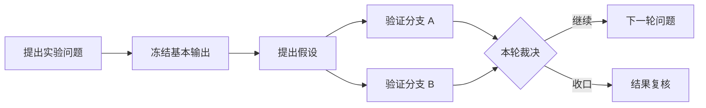
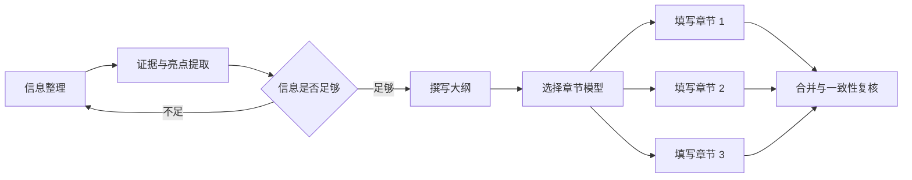

# Personal AI OS v0.6 开发任务书

## 目标

v0.6 要把当前的合成 Long Work 演示推进为一个本地可运行的个人 AI 操作层：界面动作能够调用受控 API，任务能够进入真实模型或工具，运行状态能够回到任务卡，用户能够查看每一步做过什么，并在关键节点改变模型、流程或决策。

这一版的成功标准不是增加更多看板，而是打通一条最小真实闭环：

> 创建任务 → 选择或自动匹配模型 → 启动真实运行 → 展示运行进度与宠物动画 → 收集结果 → 人工验收 → 继续下一个节点

## 当前能力验收

当前公开版是一个边界清楚的 v0.5 合成演示，不是运行控制台。

| 入口或动作 | 当前实际行为 | v0.6 要达到的状态 |
|---|---|---|
| 模块地图、业务线切换、任务卡选择 | 浏览器内切换视图 | 保留；数据改为读取本地运行时投影 |
| 运行合成扫描 | 对固定的示例文件列表做前端规则判断 | 调用只读工作区检查 API，并返回可确认的扫描结果 |
| 开箱模板 | 在浏览器内选择预设业务线 | 通过工作流模板生成可持久化的计划候选 |
| 对话创建任务 | 使用前端关键词规则生成内存任务 | 调用规划能力，返回任务、依赖、业务线与模型候选 |
| 确认计划、批准、退回 | 修改浏览器内存 | 写入本地任务事件，并由服务端状态机验证 |
| 分派并开始、提交验收、接受并收口 | 直接推进演示状态 | 先取得运行回执，再根据真实结果开放后续动作 |
| `inspect`、`plan`、`modules`、`spec` | 可真实运行；只读或输出候选 JSON | 作为本地 API 和 CLI 的共用内核继续使用 |
| 动态路由与任务分配 | 可计算兼容路由和执行者，但不启动外部工具 | 接入模型目录、适配器可用性和真实运行容量 |

当前仓库没有本地服务、持久化运行记录、模型 API、外部软件适配器或真实执行回执。界面不得把这些能力标成“可用”，直到相应端到端验收通过。

## v0.6 的系统骨架

### 1. 一个事实源

任务、工作流、决定和运行回执由本地运行时保存。模块地图、工作进度、待我决定、科研视图和文书视图都是同一份状态的不同投影，不在前端各自维护事实。

本地持久化首版使用 Python 标准库 SQLite：

- `workflows` 保存已确认的工作流实例；
- `tasks` 保存当前任务快照；
- `task_events` 保存状态变化、决定和人工操作；
- `runs` 保存模型、工具、会话和结果绑定；
- `run_events` 保存启动、心跳、进展、完成、失败和取消事件；
- `artifacts` 只保存产物引用、类型和可见范围，不复制私人内容到公开仓库。

内核继续保持无 Web 依赖；本地服务作为可选的 `runtime` 安装项提供 FastAPI、SSE 和浏览器工作台。

### 2. 工作流图，而不是一条进度条

工作流节点至少包含：

```json
{
  "task_id": "research:loop-02:validate",
  "workflow_id": "research-demo",
  "line_id": "research",
  "kind": "validation",
  "title": "验证第二轮假设",
  "depends_on": ["research:loop-02:hypothesis"],
  "loop_id": "loop-02",
  "acceptance": "验证结果、证据引用与下一轮判断均已记录",
  "required_capabilities": ["research", "tool_use"],
  "human_gate": false
}
```

可执行依赖始终保持有向无环。科研中的“循环”通过实例化 `loop-01`、`loop-02` 等迭代来表达；上一轮验证结果可以生成下一轮问题节点，但不能在调度依赖中制造环。界面可以画出回环关系，调度器仍然能够确定下一项可执行任务。

### 3. 运行适配器

所有外部副作用只能通过有限适配器接口发生：

```text
probe → discover_models → start → status/events → cancel → resume → open_ui
```

每次启动至少返回：

- `run_id`；
- `adapter_id`、`provider_id`、`model_id`；
- 外部会话或请求标识，例如 `thread_id`、`turn_id`、`session_id` 或 `provider_request_id`；
- 当前状态和首次心跳；
- 被分配的 `pet_id`；
- 工作区边界和产物引用策略。

未取得适配器确认和外部会话标识时，任务保持待分配或阻塞，不能显示为“进行中”。模型失败时不自动换模型，除非用户已经保存明确的回退策略。

### 4. 能力驱动的模型目录

模型选择不硬编码“最好写作模型”。每个适配器提供当前可用模型及其能力：

- 文本、图像、代码、工具调用等输入输出能力；
- 上下文与输出限制；
- 速度、成本和隐私标签；
- 稳定版、预览版或实验版生命周期；
- 本地可用性、凭据状态和并发容量；
- 用户保存的用途偏好和实际评测标签。

用户可以在任一可分派节点手动选择模型，也可以保存规则，例如“证据收集完成后，在满足长文写作能力的模型中优先使用我标记为写作质量高的模型”。Gemini 或 Claude Sonnet 等名称只作为用户配置示例；运行时保存并调用供应商返回的真实模型 ID。

## 两条非线性演示工作流

### 科研线

科研线使用“迭代组 + 并行分支 + 任务详情”布局。



界面要求：

- 每一轮形成可折叠的 `Loop 01`、`Loop 02` 迭代组；
- 同一轮的并行实验横向分叉，节点显示依赖、负责人、模型和状态；
- 点击节点打开任务详情，展示任务来源、验收条件、事件时间线、运行记录、证据和产物；
- “冻结基本输出”是可引用的阶段资产，不等同于科研结论；
- 每轮结束可以收口、生成下一轮问题，或进入“待我决定”。

### 文书线

文书线使用“资料漏斗 + 大纲树 + 并行章节”布局。



“信息不足 → 继续整理”同样通过新的证据迭代实例表达，不在可执行依赖中形成环。

界面要求：

- 资料和证据节点显示覆盖度、引用和缺口；
- 大纲是可展开的树，每个章节可以独立分派模型和工具；
- 章节可以并行执行，合并节点等待所有必要章节达到验收条件；
- 用户可以在“信息足够”裁决后重新筛选模型，再启动后续写作；
- 点击任一节点都能看到已经完成的动作、模型运行、修改记录和产物版本。

## 小宠物工作演示线

宠物是运行状态的可视化，不是进度事实。

### 宠物包合同

公开版继承 `pet-registry.v2` 的核心约定，并扩展为每个状态可以配置多段动画：

```json
{
  "pet_id": "example-pet",
  "display_name": "Example Pet",
  "default_for_models": ["provider/model-id"],
  "animations": {
    "idle": ["idle-01.webp"],
    "working": ["work-01.webp", "work-02.webp", "work-03.webp"],
    "review": ["review-01.webp"],
    "done": ["done-01.webp"],
    "error": ["error-01.webp"]
  },
  "license": {
    "source": "https://example.com/source",
    "author": "Example Author",
    "spdx": "CC-BY-4.0",
    "attribution": "Required attribution text"
  }
}
```

解析优先级为：本次运行显式 `pet_id` → 用户的模型映射 → 宠物包默认映射 → 全局 fallback。

### 播放规则

- 任务取得真实 `run_id` 并收到启动事件后，宠物进入 `working`；
- 运行心跳或进展事件持续驱动工作状态；心跳失联时显示连接异常，不伪装成完成；
- 同一状态的动画使用 shuffle bag 随机轮播，播完一轮前不重复；
- 随机种子绑定 `run_id`，刷新页面后保持可解释的一致性；
- 等待人工确认时进入 `review`，成功进入 `done`，失败或取消进入 `error` 或 `idle`；
- 页面离开可见区域时暂停解码；尊重 `prefers-reduced-motion`；
- 用户可以覆盖“模型 → 宠物”映射，不把宠物身份与执行平台耦合。

私有原型中的宠物代码合同可以继承。动画素材只有在来源、作者和公开许可完整时才进入 Public 仓库；候选素材和来源不明素材继续留在私有资产区。

## 本地 API

首版 API 只开放界面真正需要的动作：

| 方法 | 端点 | 结果 |
|---|---|---|
| `GET` | `/api/v1/capabilities` | 当前可用、预览和不可用的动作及原因 |
| `POST` | `/api/v1/intake/inspect` | 对指定本地目录执行有边界的只读检查 |
| `POST` | `/api/v1/plans` | 生成计划候选 |
| `POST` | `/api/v1/plans/{id}/accept` | 接受计划并实例化工作流 |
| `GET` | `/api/v1/workflows/{id}` | 返回工作流图和各业务线投影 |
| `GET` | `/api/v1/tasks/{id}` | 返回任务详情、依赖、事件、运行和产物 |
| `POST` | `/api/v1/tasks` | 创建任务候选或手动任务 |
| `POST` | `/api/v1/tasks/{id}/decisions` | 记录批准、退回、改路由等人工决定 |
| `GET` | `/api/v1/models` | 返回当前适配器发现的模型和能力 |
| `POST` | `/api/v1/runs` | 校验任务与模型后启动一次真实运行 |
| `GET` | `/api/v1/runs/{id}` | 返回运行回执 |
| `GET` | `/api/v1/events` | 通过 SSE 推送任务和运行事件 |
| `POST` | `/api/v1/runs/{id}/cancel` | 请求适配器停止运行 |
| `POST` | `/api/v1/runs/{id}/open` | 打开已绑定的外部对话或工具界面 |

工作台启动时先读取 `/capabilities`。缺少适配器、凭据或本地软件的动作显示明确原因并保持不可点击，不能用前端乐观更新假装成功。

## 适配器落地顺序

### A. Codex App Server

第一条真实对话线使用 Codex App Server。适配器完成 initialize、thread/start、turn/start，只有同时取得 `thread_id` 和 `turn_id` 才登记运行。流式事件更新心跳、宠物和任务详情；turn/completed 只表示模型回合结束，任务仍需按验收规则进入 Review。

### B. VS Code

基础能力使用 `code --reuse-window <workspace>` 打开目标工作区，并使用 `code chat` 启动支持的 Chat。仅成功打开窗口或预填提示词属于 `HANDOFF`；只有扩展、CLI 或桥接器返回可绑定会话和提交回执时，任务才能进入 `IN_PROGRESS`。

### C. 直接模型 API

分别实现供应商适配器，复用统一运行合同：

- DeepSeek 通过官方 OpenAI-compatible 或 Anthropic-compatible API；
- Claude 通过 Messages API，并用 Models API发现当前可用模型；
- Gemini 通过官方模型列表和生成接口，生产配置优先固定稳定模型 ID；
- 其他 OpenAI-compatible 服务通过用户显式填写的 base URL 和模型目录接入。

凭据只保存在本机环境变量、系统钥匙串或运行时私有配置中，不写入 SQLite 事件正文、浏览器状态或 Git 仓库。

### D. DeepSeek Harness

DeepSeek Harness 是执行器，不与 DeepSeek 模型 API 混为一个适配器。首版使用官方 Python SDK 或 JSON-RPC stdio，固定经过验证的版本，并把 workspace、session、approval、sandbox 和事件订阅放入独立适配器。它仍处于 developer preview；协议变更只能影响该适配器，不能改变任务与运行核心合同。

## 工作包与验收条件

### V06-01：动作真实性审计

- 为每个可见按钮建立 `action_id`、服务端 capability 和测试；
- 删除没有产品动作的假按钮；尚未接通的动作显示“预览”或不可用原因；
- 验收：自动测试能够枚举页面按钮，并证明每个按钮具有真实 handler 或明确 disabled 状态。

### V06-02：本地运行时与持久化

- 建立 SQLite 事件存储、FastAPI 服务、SSE 和 `personal-ai-os serve`；
- CLI 与 API 调用同一套内核，不复制状态逻辑；
- 验收：创建、决定和运行事件在服务重启后仍可读回，非法状态转换返回可解释错误。

### V06-03：工作流图与任务详情

- 扩展任务合同，支持迭代实例、并行分支、决策节点、产物和运行记录；
- 增加任务详情抽屉和完整事件时间线；
- 验收：点击任务可以回答“它为何产生、做过什么、现在卡在哪、下一步是什么”。

### V06-04：模型目录、筛选与自动流转

- 建立模型能力合同、适配器探测、筛选器、用户偏好和手动覆盖；
- 后续节点只有在依赖和能力都满足时自动开放；
- 验收：用户可以在文书线证据节点之后更换模型，系统用新选择启动后续章节，且不改变已经完成的历史运行。

### V06-05：真实 Codex 纵向闭环

- 接入 App Server，保存 thread/turn、进展、完成和失败回执；
- 提供打开和续接对话动作；
- 验收：一张任务卡能够启动真实对话、显示进展、读取完成事件并进入待验收；握手失败时任务状态不前进。

### V06-06：宠物运行投影

- 实现宠物注册、模型映射、动画随机轮播、心跳和 reduced-motion；
- 只加入许可完整的公开演示素材；
- 验收：宠物状态由同一 `run_id` 的真实事件驱动，刷新和重启后不把旧运行显示为仍在工作。

### V06-07：科研循环演示线

- 实现科研模板、迭代组、并行验证和轮末裁决；
- 验收：完成一轮后可以收口或实例化下一轮，调度图始终无环，并行任务能够独立运行。

### V06-08：文书非线性演示线

- 实现资料、证据、亮点、大纲、章节、合并和复核节点；
- 验收：多个章节可以使用不同模型并行完成，合并节点等待所有必需输入，任务详情保留每次生成和修改记录。

### V06-09：VS Code、直接 API 与 DeepSeek Harness

- 按适配器顺序逐一接通，并为每个适配器提供 probe、启动、事件、取消和打开界面能力；
- 验收：缺少软件、凭据或协议不兼容时 fail closed；每个宣称可用的适配器至少有一个选择性真实环境测试和完整的假适配器合同测试。

### V06-10：公开演示封包

- 提供一键启动、本地示例库、合成工作流和清晰的能力状态；
- 执行密钥、路径、运行日志和宠物素材许可检查；
- 验收：新用户从克隆仓库到启动演示不需要修改源码，未配置模型时仍能使用合成适配器理解完整流程，配置真实适配器后同一界面能够执行真实任务。

## 推荐实施顺序

1. 先完成 V06-01 至 V06-03，让所有按钮、状态和详情有真实服务端来源。
2. 完成 V06-04 和 V06-05，跑通模型选择到 Codex 回执的第一条真实闭环。
3. 完成 V06-06，把宠物绑定到已经可信的运行事件。
4. 完成 V06-07 和 V06-08，用同一个图内核承载科研与文书两种非线性形态。
5. 完成 V06-09 和 V06-10，再扩展 DeepSeek、Claude、Gemini、VS Code 与 Harness，而不改变核心任务合同。

## 发布门槛

- 页面不存在会把合成状态误报为真实运行的按钮；
- 所有 `IN_PROGRESS` 任务都有可读的 `run_id` 和外部确认；
- 服务重启后任务、决定、运行和宠物状态可以恢复；
- 科研循环不会破坏依赖调度的无环不变量；
- 模型手动选择不能绕过能力、上下文和权限要求；
- 供应商失败不会触发未经用户授权的自动回退；
- 密钥、私人路径、输入正文和真实产物不进入公开仓库；
- 所有公开宠物资产具有可核验的来源与许可；
- Python、API、工作台行为测试和至少一条真实适配器验收全部通过后，才能把 v0.6 标记为真实运行预览版。

## 接入依据

- [OpenAI Codex App Server architecture and lifecycle](https://openai.com/index/unlocking-the-codex-harness/)
- [Visual Studio Code command-line interface](https://code.visualstudio.com/docs/configure/command-line)
- [DeepSeek API first call and compatibility](https://api-docs.deepseek.com/guides/function_calling/)
- [DeepSeek Harness official repository](https://github.com/deepseek-ai/deepseek-harness)
- [DeepSeek Harness Python SDK guide](https://github.com/deepseek-ai/deepseek-harness/blob/master/docs/user/guide/python-sdk.md)
- [Claude API overview](https://platform.claude.com/docs/en/api/overview)
- [Claude Models API](https://platform.claude.com/docs/en/api/models)
- [Gemini API model versioning](https://ai.google.dev/gemini-api/docs/models)
